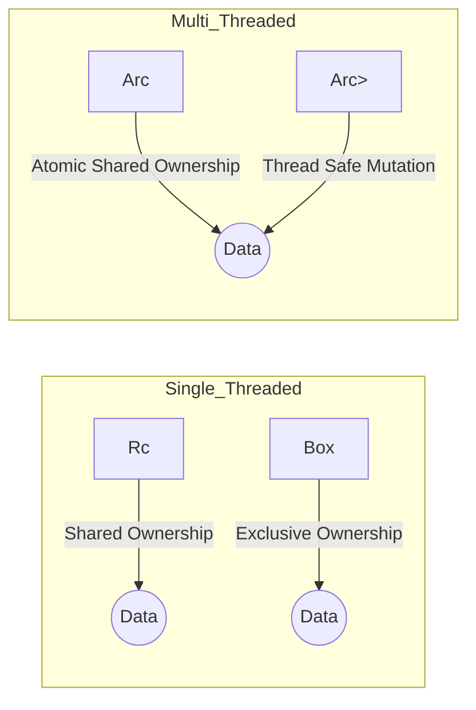

# Rust Advance Q&A

## Q1: Explain the difference between `Rc<T>` and `Arc<T>`.
en: `Rc<T>` (Reference Counted) is for single-threaded multiple ownership. `Arc<T>` (Atomic Reference Counted) is the thread-safe version of `Rc<T>`, using atomic operations to manage the reference count across threads, which adds a small performance overhead.
vi: `Rc<T>` (Reference Counted) dùng cho đa sở hữu trong môi trường đơn luồng. `Arc<T>` (Atomic Reference Counted) là phiên bản an toàn đa luồng của `Rc<T>`, sử dụng các toán tử nguyên tử (atomic) để quản lý số lượng tham chiếu giữa các luồng, điều này đi kèm với một chút chi phí về hiệu năng.

---

## Q2: What is Interior Mutability and how do `Cell` and `RefCell` work?
en: Interior mutability allows you to mutate data even when there are immutable references to that data. `Cell<T>` works by copying values in and out, while `RefCell<T>` enforces borrowing rules at runtime instead of compile time, panicking if rules are violated.
vi: Interior mutability (Tính khả biến nội bộ) cho phép bạn thay đổi dữ liệu ngay cả khi có các tham chiếu không thể thay đổi tới dữ liệu đó. `Cell<T>` hoạt động bằng cách sao chép các giá trị ra vào, trong khi `RefCell<T>` áp dụng các quy tắc borrowing tại thời điểm thực thi (runtime) thay vì biên dịch, và sẽ gây ra panic nếu quy tắc bị vi phạm.

---

## Q3: Explain `Send` and `Sync` traits.
en: `Send` marks a type that can be safely transferred between threads. `Sync` marks a type that can be safely shared between threads via references (`&T` is `Send`). Almost all primitive types are `Send` and `Sync`, but types like `Rc` are not.
vi: Trait `Send` đánh dấu một kiểu dữ liệu có thể chuyển giao an toàn giữa các luồng. Trait `Sync` đánh dấu một kiểu có thể được chia sẻ an toàn giữa các luồng thông qua tham chiếu (`&T` là `Send`). Hầu hết các kiểu nguyên thủy đều là `Send` và `Sync`, nhưng các kiểu như `Rc` thì không.

---

## Q4: How does `async/await` work internally in Rust?
en: In Rust, an `async` function returns a `Future`, which is a state machine. The execution is driven by an executor (like Tokio). When an `await` point is reached, the focus returns to the executor if the future is not ready, allowing other tasks to run.
vi: Trong Rust, một hàm `async` trả về một `Future`, thực chất là một máy trạng thái (state machine). Việc thực thi được điều khiển bởi một bộ thực thi (executor như Tokio). Khi gặp điểm `await`, nếu future chưa sẵn sàng, quyền điều khiển sẽ trả về cho bộ thực thi để cho phép các tác vụ khác chạy.

---

## Q5: What is a `Box<T>` and when should you use it?
en: `Box<T>` is a smart pointer that allocates data on the heap. You use it when: 1. You have a type whose size cannot be known at compile time (trait objects). 2. You want to transfer ownership of a large amount of data without copying. 3. You need to own a value of a type that implements a trait.
vi: `Box<T>` là một con trỏ thông minh giúp cấp phát dữ liệu trên heap. Bạn sử dụng nó khi: 1. Bạn có một kiểu dữ liệu mà kích thước không thể biết trước khi biên dịch (trait objects). 2. Bạn muốn chuyển quyền sở hữu một lượng dữ liệu lớn mà không cần sao chép. 3. Bạn cần sở hữu một giá trị của một kiểu đã triển khai một trait nào đó.

---

## Q6: Explain "Zero-Cost Abstractions" in Rust.
en: It means that the abstractions you use (like iterators, closures, or async) do not add any runtime overhead compared to writing the equivalent code by hand in a lower-level way. The compiler optimizes them away into efficient machine code.
vi: Nó có nghĩa là các lớp trừu tượng bạn sử dụng (như iterators, closures, hoặc async) không gây ra thêm bất kỳ chi phí thực thi (runtime overhead) nào so với việc viết mã tương đương bằng tay theo cách cấp thấp hơn. Trình biên dịch sẽ tối ưu hóa chúng thành mã máy hiệu quả.

---

## Q7: What is `Unsafe` Rust and why is it needed?
en: `Unsafe` Rust gives you additional powers like: 1. Dereferencing raw pointers. 2. Calling unsafe functions. 3. Accessing/modifying static mutable variables. It's needed for low-level system interactions, FFI, and building safe abstractions over manual memory management.
vi: `Unsafe` Rust cung cấp cho bạn các quyền hạn bổ sung như: 1. Giải tham chiếu con trỏ thô (raw pointers). 2. Gọi các hàm không an toàn (unsafe). 3. Truy cập/sửa đổi các biến tĩnh khả biến. Nó cần thiết cho các tương tác hệ thống cấp thấp, FFI, và xây dựng các trừu tượng an toàn dựa trên việc quản lý bộ nhớ thủ công.

---

## Q8: What are Macros in Rust (Declarative vs Procedural)?
en: Macros allow metaprogramming. **Declarative macros** (`macro_rules!`) match patterns and replace them with code code. **Procedural macros** (Custom Derive, Attribute-like, Function-like) act more like functions that consume code as a stream of tokens and produce new tokens.
vi: Macros cho phép lập trình meta (metaprogramming). **Declarative macros** (`macro_rules!`) khớp theo mẫu và thay thế chúng bằng mã. **Procedural macros** (Custom Derive, Attribute-like, Function-like) hoạt động giống như các hàm nhận vào mã dưới dạng luồng các token và tạo ra các token mới.

---

## Q9: Explain the `Pin` type and why it's important for `Future`.
en: `Pin` ensures that a value cannot be moved in memory. This is critical for self-referential structures, such as those generated by `async` blocks, where a future might contain pointers to its own fields. If the future moved, those pointers would become invalid.
vi: `Pin` đảm bảo rằng một giá trị không thể bị di chuyển trong bộ nhớ. Điều này cực kỳ quan trọng đối với các cấu trúc tự tham chiếu (self-referential), chẳng hạn như những cấu trúc được tạo ra bởi các khối `async`, nơi một future có thể chứa các con trỏ trỏ đến các trường của chính nó. Nếu future bị di chuyển, các con trỏ đó sẽ trở nên không hợp lệ.

---

## Q10: What is the difference between `Deref` and `DerefMut`?
en: `Deref` allows you to treat a smart pointer like a regular reference (`*` operator or method access). `DerefMut` does the same for mutable references. They are used for "Deref coercion," allowing functions to accept smart pointers as if they were references.
vi: `Deref` cho phép bạn đối xử với một con trỏ thông minh như một tham chiếu thông thường (toán tử `*` hoặc truy cập phương thức). `DerefMut` tương tự nhưng dành cho các tham chiếu có thể thay đổi. Chúng được sử dụng cho "Deref coercion", cho phép các hàm chấp nhận các con trỏ thông minh như thể chúng là các tham chiếu.

---

## Visualization of Smart Pointer Ownership



---

## Q11: What is the difference between `mut` and Shadowing in Rust?
en: While both allow "changing" a value, they work differently:
1. **Shadowing**: Creates a *new* variable with the same name. It can change the memory address and even the **data type**. The original variable still exists in memory until the end of its scope, but it's inaccessible.
2. **`mut`**: Allows you to mutate the *existing* value in the *same* memory location. You **cannot** change the data type of the variable.

vi: Mặc dù cả hai đều cho phép "thay đổi" một giá trị, nhưng chúng hoạt động khác nhau:
1. **Shadowing (Che bóng)**: Tạo ra một biến *mới* hoàn toàn với cùng tên. Nó có thể thay đổi địa chỉ bộ nhớ và thậm chí cả **kiểu dữ liệu**. Biến ban đầu vẫn tồn tại trong bộ nhớ cho đến khi hết phạm vi (scope) của nó, nhưng không thể truy cập được nữa.
2. **`mut` (Khả biến)**: Cho phép bạn sửa đổi giá trị *hiện tại* trong *cùng* một vị trí bộ nhớ. Bạn **không thể** thay đổi kiểu dữ liệu của biến đó.

```rust
// Shadowing: Can change type
let x = "five"; 
let x = 5; 

// mut: Same type, same memory
let mut y = 5;
y = 6; 
// y = "six"; // en: Error! / vi: Lỗi!
```

