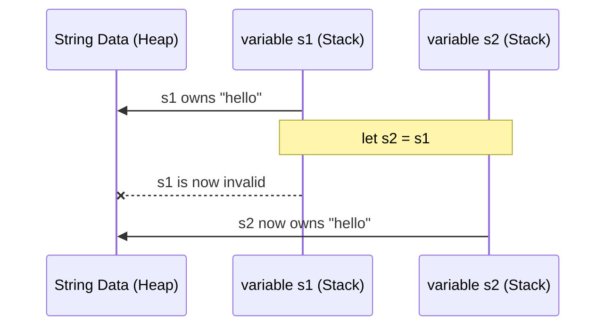

# Rust Foundation Q&A

## Q1: What is Ownership in Rust? - **HIGH**
en: Ownership is Rust's most unique feature for managing memory. It consists of three rules: 1. Each value has a variable called its owner. 2. There can only be one owner at a time. 3. When the owner goes out of scope, the value is dropped.
vi: Ownership (Quyền sở hữu) là tính năng độc đáo nhất của Rust để quản lý bộ nhớ. Nó bao gồm ba quy tắc: 1. Mỗi giá trị có một biến được gọi là owner của nó. 2. Chỉ có thể có một owner tại một thời điểm. 3. Khi owner ra khỏi phạm vi (scope), giá trị sẽ bị hủy (dropped).

---

## Q2: Explain Borrowing and the difference between shared and mutable references. - **HIGH**
en: Borrowing allows you to access data without taking ownership. You can have either: 1. Any number of shared references (`&T`), OR 2. Exactly one mutable reference (`&mut T`). You cannot have both at the same time in the same scope.

vi: Borrowing (Vay mượn) cho phép bạn truy cập dữ liệu mà không cần lấy quyền sở hữu. Bạn có thể có: 1. Bất kỳ số lượng tham chiếu chia sẻ nào (`&T`), HOẶC 2. Duy nhất một tham chiếu có thể thay đổi (`&mut T`). Bạn không thể có cả hai cùng lúc trong cùng một phạm vi.

```rust
fn main() {
    let mut s = String::from("hello");

    // 1. Shared Borrowing (Multiple allowed)
    // 1. Tham chiếu chia sẻ (Cho phép nhiều tham chiếu)
    let r1 = &s; 
    let r2 = &s; 
    println!("{} and {}", r1, r2); 

    // 2. Mutable Borrowing (Only ONE allowed)
    // 2. Tham chiếu thay đổi (Chỉ cho phép DUY NHẤT một)
    let r3 = &mut s; 
    r3.push_str(", world");
    println!("{}", r3);

    // 3. Conflict (The Error Case / Trường hợp LỖI)
    // let r4 = &s;     
    // let r5 = &mut s; // en: ERROR! / vi: LỖI!
}
```

---

## Q3: What are Lifetimes in Rust?
en: Lifetimes are a way for the compiler to ensure that all borrows are valid for as long as they are used. They prevent "dangling references" where a reference points to memory that has already been deallocated.
vi: Lifetimes (Vòng đời) là cách để trình biên dịch đảm bảo rằng tất cả các khoản vay (borrows) đều hợp lệ trong suốt thời gian chúng được sử dụng. Chúng ngăn chặn "tham chiếu lơ lửng" (dangling references) - nơi một tham chiếu trỏ đến bộ nhớ đã bị giải phóng.

---

## Q4: What is the difference between `String` and `&str`?
en: `String` is an owned, heap-allocated, growable string. `&str` (string slice) is an immutable reference to a string stored elsewhere (on the heap, stack, or static memory).
vi: `String` là một chuỗi có quyền sở hữu, được cấp phát trên heap và có thể mở rộng. `&str` (string slice) là một tham chiếu không thể thay đổi tới một chuỗi được lưu trữ ở nơi khác (trên heap, stack hoặc bộ nhớ tĩnh).

---

## Q5: How does Rust handle errors? (Result vs Option)
en: Rust uses `Option<T>` for values that may or may not exist (None/Some) and `Result<T, E>` for operations that can fail (Ok/Err). It encourages explicit error handling rather than using exceptions.
vi: Rust sử dụng `Option<T>` cho các giá trị có thể tồn tại hoặc không (None/Some) và `Result<T, E>` cho các thao tác có thể thất bại (Ok/Err). Nó khuyến khích xử lý lỗi tường minh thay vì sử dụng ngoại lệ (exceptions).

---

## Q6: What is a `struct` and what are its types?
en: A `struct` (structure) allows you to group related data. Rust has three types: 1. Classic C-like structs with named fields. 2. Tuple structs (fields have no names, just positions). 3. Unit-like structs (no fields at all).
vi: Một `struct` (cấu trúc) cho phép bạn nhóm các dữ liệu liên quan. Rust có ba loại: 1. Struct kiểu C cổ điển với các trường có tên. 2. Tuple structs (các trường không có tên, chỉ có vị trí). 3. Unit-like structs (không có trường nào).

---

## Q7: Explain Pattern Matching in Rust.
en: Pattern matching uses the `match` keyword to compare a value against a series of patterns and execute code based on which pattern matches. It is exhaustive, meaning you must handle all possible cases.
vi: Khớp mẫu (Pattern matching) sử dụng từ khóa `match` để so sánh một giá trị với một loạt các mẫu và thực thi mã dựa trên mẫu nào khớp. Nó mang tính triệt để (exhaustive), nghĩa là bạn phải xử lý tất cả các trường hợp có thể xảy ra.

---

## Q8: What are Traits in Rust?
en: Traits define shared behavior that types can implement. They are similar to interfaces in other languages, allowing for polymorphism and defining constraints on generic types.
vi: Traits định nghĩa các hành vi chung mà các kiểu dữ liệu có thể triển khai. Chúng tương tự như các interface trong các ngôn ngữ khác, cho phép tính đa hình và định nghĩa các ràng buộc trên các kiểu generic.

---

## Q9: What is the purpose of `Cargo.toml` and `Cargo.lock`?
en: `Cargo.toml` is the manifest file where you list dependencies and package metadata. `Cargo.lock` contains the exact versions of dependencies used, ensuring reproducible builds across different environments.
vi: `Cargo.toml` là tệp kê khai nơi bạn liệt kê các phụ thuộc (dependencies) và siêu dữ liệu của gói. `Cargo.lock` chứa các phiên bản chính xác của các phụ thuộc được sử dụng, đảm bảo khả năng tái lập bản build trên các môi trường khác nhau.

---

## Q10: What does the `mut` keyword do?
en: In Rust, variables are immutable by default. The `mut` keyword is used to make a variable mutable, allowing its value to be changed after it has been initialized.
vi: Trong Rust, các biến mặc định là không thể thay đổi (immutable). Từ khóa `mut` được sử dụng để làm cho một biến có thể thay đổi, cho phép giá trị của nó được thay đổi sau khi đã được khởi tạo.

---

## Visualizing Ownership Transfer (Move)



---

## Q11: What is Shadowing in Rust and how does it differ from Mutability?
en: Shadowing allows a programmer to declare a new variable with the same name as a previous variable. The new variable shadows the previous one. This is different from `mut` because: 1. You can change the data type of the variable. 2. You don't need to make the variable mutable if you only want to transform its value and then keep it immutable.
vi: Shadowing (Cơ chế che bóng) cho phép lập trình viên khai báo một biến mới có cùng tên với một biến trước đó. Biến mới sẽ che bóng biến cũ. Điều này khác với `mut` vì: 1. Bạn có thể thay đổi kiểu dữ liệu của biến. 2. Bạn không cần khai báo biến là `mut` nếu bạn chỉ muốn biến đổi giá trị của nó rồi sau đó giữ nguyên trạng thái không đổi (immutable).

```rust
fn main() {
    let x = 5;
    let x = x + 1; // en: Shadowing / vi: Che bóng
    {
        let x = x * 2; // en: Shadowing in inner scope / vi: Che bóng trong scope con
        println!("Inner x: {}", x); // 12
    }
    println!("Outer x: {}", x); // 6
    
    // en: Changing type with shadowing
    // vi: Thay đổi kiểu dữ liệu bằng shadowing
    let spaces = "   ";
    let spaces = spaces.len(); 
}
```

---

## Q12: What are Scalar and Compound types in Rust?
en: Rust divides its data types into two main categories:
1. **Scalar Types**: Represent a single value. There are four primary scalar types: integers (`i32`, `u64`, etc.), floating-point numbers (`f32`, `f64`), Booleans (`bool`), and characters (`char`).
2. **Compound Types**: Can group multiple values into one type. Rust has two primitive compound types: **Tuples** (fixed-size, multiple types) and **Arrays** (fixed-size, same type).

vi: Rust chia các kiểu dữ liệu của mình thành hai loại chính:
1. **Scalar Types (Kiểu vô hướng)**: Đại diện cho một giá trị duy nhất. Có bốn kiểu vô hướng cơ bản: số nguyên (`i32`, `u64`, v.v.), số thực phẩy động (`f32`, `f64`), Boolean (`bool`), và ký tự (`char`).
2. **Compound Types (Kiểu hỗn hợp)**: Có thể nhóm nhiều giá trị vào một kiểu. Rust có hai kiểu hỗn hợp nguyên thủy: **Tuples** (kích thước cố định, nhiều kiểu dữ liệu) và **Arrays** (mảng - kích thước cố định, cùng một kiểu dữ liệu).

```rust
// Scalar
let x: i32 = 42;
let is_active: bool = true;

// Compound
let tup: (i32, f64, u8) = (500, 6.4, 1);
let arr: [i32; 3] = [1, 2, 3];
```

> **Note on `String` type**:
> en: `String` is NOT a Scalar or primitive Compound type. It is a **Collection** type because it is a growable buffer on the heap.
> vi: `String` KHÔNG phải là kiểu Scalar hay Compound nguyên thủy. Nó là kiểu **Collection (Bộ sưu tập)** vì nó là một vùng đệm có thể mở rộng trên heap.

---

## Q13: If `String` is stored on the heap, where is the `&str` (string slice) that points to it stored? Is it a scalar type?
en: The `&str` (string slice) itself is stored on the **stack**. It is a "fat pointer" consisting of two parts: a pointer to the data and the length of the slice. While it represents a single "borrowed" reference, it's not strictly a single primitive scalar type because it's a composite of two values (pointer + length), but it behaves like a scalar value as it is passed by value.
vi: Tự thân `&str` (string slice) được lưu trữ trên **stack**. Nó là một "fat pointer" (con trỏ béo) bao gồm hai phần: một con trỏ tới dữ liệu và chiều dài của slice đó. Mặc dù nó đại diện cho một tham chiếu "vay mượn" đơn lẻ, nó không hoàn toàn là một kiểu scalar nguyên thủy đơn giản vì nó là một cấu trúc gồm hai giá trị (con trỏ + chiều dài), nhưng nó hoạt động giống như một giá trị scalar vì được truyền đi theo giá trị.

---

## Q14: What happens to the heap memory when a `String` goes out of scope? Does Rust have a Garbage Collector?
en: No, Rust does **not** have a Garbage Collector (GC). Instead, it uses a mechanism called **RAII** (Resource Acquisition Is Initialization). When a `String` (the owner) goes out of scope, Rust automatically calls a special function named `drop`, which deallocates the heap memory immediately.
vi: Không, Rust **không** có Bộ thu gom rác (Garbage Collector - GC). Thay vào đó, nó sử dụng một cơ chế gọi là **RAII** (Resource Acquisition Is Initialization). Khi một `String` (chủ sở hữu) ra khỏi phạm vi, Rust tự động gọi một hàm đặc biệt tên là `drop`, hàm này sẽ giải phóng bộ nhớ heap ngay lập tức.


