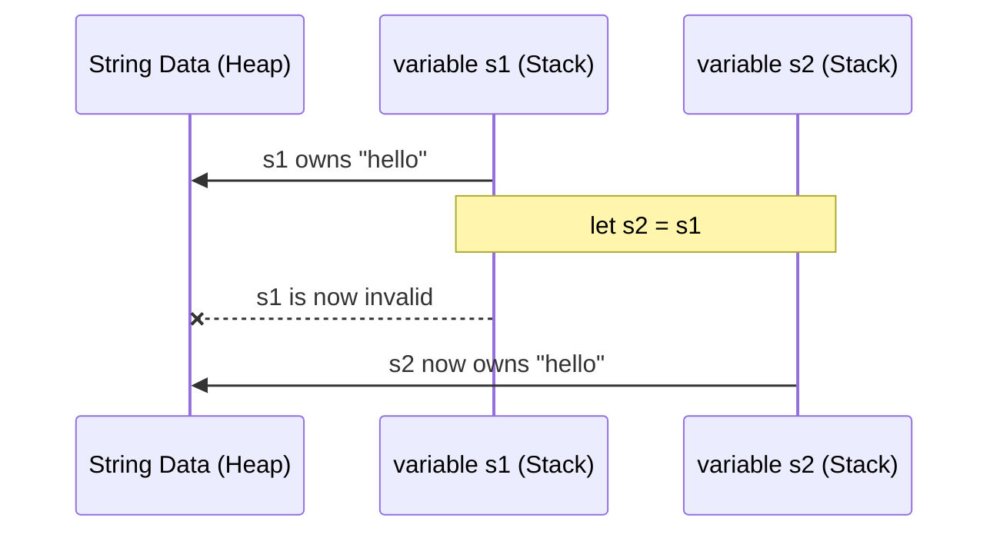

# Rust Foundation Q&A

## Q1: What is Ownership in Rust?
en: Ownership is Rust's most unique feature for managing memory. It consists of three rules: 1. Each value has a variable called its owner. 2. There can only be one owner at a time. 3. When the owner goes out of scope, the value is dropped.
vi: Ownership (Quyền sở hữu) là tính năng độc đáo nhất của Rust để quản lý bộ nhớ. Nó bao gồm ba quy tắc: 1. Mỗi giá trị có một biến được gọi là owner của nó. 2. Chỉ có thể có một owner tại một thời điểm. 3. Khi owner ra khỏi phạm vi (scope), giá trị sẽ bị hủy (dropped).

---

## Q2: Explain Borrowing and the difference between shared and mutable references.
en: Borrowing allows you to access data without taking ownership. You can have either: 1. Any number of shared references (`&T`), OR 2. Exactly one mutable reference (`&mut T`). You cannot have both at the same time in the same scope.
vi: Borrowing (Vay mượn) cho phép bạn truy cập dữ liệu mà không cần lấy quyền sở hữu. Bạn có thể có: 1. Bất kỳ số lượng tham chiếu chia sẻ nào (`&T`), HOẶC 2. Duy nhất một tham chiếu có thể thay đổi (`&mut T`). Bạn không thể có cả hai cùng lúc trong cùng một phạm vi.

---

## Q3: What are Lifetimes in Rust?
en: Lifetimes are a way for the compiler to ensure that all borrows are valid for as long as they are used. They prevent "dangling references" where a reference points to memory that has already been deallocated.
vi: Lifetimes (Vòng đời) là cách để trình biên dịch đảm bảo rằng tất cả các khoản vay (borrows) đều hợp lệ trong suốt thời gian chúng được sử dụng. Chúng ngăn chặn "tham chiếu lơ lửng" (dangling references) - nơi một tham chiếu trỏ đến bộ nhớ đã bị giải phóng.

---

## Q4: What is the difference between `String` and `&str`?
en: `String` is an owned, heap-allocated, growable string. `&str` (string slice) is an immutable reference to a string stored elsewhere (on the heap, stack, or static memory).
vi: `String` là một chuỗi có quyền sở hữu, được cấp phát trên heap và có thể mở rộng. `&str` (string slice) là một tham chiếu không thể thay đổi tới một chuỗi được lưu trữ ở nơi khác (trên heap, stack hoặc bộ nhớ tĩnh).

---

## Q5: How does Rust handle errors? (Result vs Option)
en: Rust uses `Option<T>` for values that may or may not exist (None/Some) and `Result<T, E>` for operations that can fail (Ok/Err). It encourages explicit error handling rather than using exceptions.
vi: Rust sử dụng `Option<T>` cho các giá trị có thể tồn tại hoặc không (None/Some) và `Result<T, E>` cho các thao tác có thể thất bại (Ok/Err). Nó khuyến khích xử lý lỗi tường minh thay vì sử dụng ngoại lệ (exceptions).

---

## Q6: What is a `struct` and what are its types?
en: A `struct` (structure) allows you to group related data. Rust has three types: 1. Classic C-like structs with named fields. 2. Tuple structs (fields have no names, just positions). 3. Unit-like structs (no fields at all).
vi: Một `struct` (cấu trúc) cho phép bạn nhóm các dữ liệu liên quan. Rust có ba loại: 1. Struct kiểu C cổ điển với các trường có tên. 2. Tuple structs (các trường không có tên, chỉ có vị trí). 3. Unit-like structs (không có trường nào).

---

## Q7: Explain Pattern Matching in Rust.
en: Pattern matching uses the `match` keyword to compare a value against a series of patterns and execute code based on which pattern matches. It is exhaustive, meaning you must handle all possible cases.
vi: Khớp mẫu (Pattern matching) sử dụng từ khóa `match` để so sánh một giá trị với một loạt các mẫu và thực thi mã dựa trên mẫu nào khớp. Nó mang tính triệt để (exhaustive), nghĩa là bạn phải xử lý tất cả các trường hợp có thể xảy ra.

---

## Q8: What are Traits in Rust?
en: Traits define shared behavior that types can implement. They are similar to interfaces in other languages, allowing for polymorphism and defining constraints on generic types.
vi: Traits định nghĩa các hành vi chung mà các kiểu dữ liệu có thể triển khai. Chúng tương tự như các interface trong các ngôn ngữ khác, cho phép tính đa hình và định nghĩa các ràng buộc trên các kiểu generic.

---

## Q9: What is the purpose of `Cargo.toml` and `Cargo.lock`?
en: `Cargo.toml` is the manifest file where you list dependencies and package metadata. `Cargo.lock` contains the exact versions of dependencies used, ensuring reproducible builds across different environments.
vi: `Cargo.toml` là tệp kê khai nơi bạn liệt kê các phụ thuộc (dependencies) và siêu dữ liệu của gói. `Cargo.lock` chứa các phiên bản chính xác của các phụ thuộc được sử dụng, đảm bảo khả năng tái lập bản build trên các môi trường khác nhau.

---

## Q10: What does the `mut` keyword do?
en: In Rust, variables are immutable by default. The `mut` keyword is used to make a variable mutable, allowing its value to be changed after it has been initialized.
vi: Trong Rust, các biến mặc định là không thể thay đổi (immutable). Từ khóa `mut` được sử dụng để làm cho một biến có thể thay đổi, cho phép giá trị của nó được thay đổi sau khi đã được khởi tạo.

---

## Visualizing Ownership Transfer (Move)

