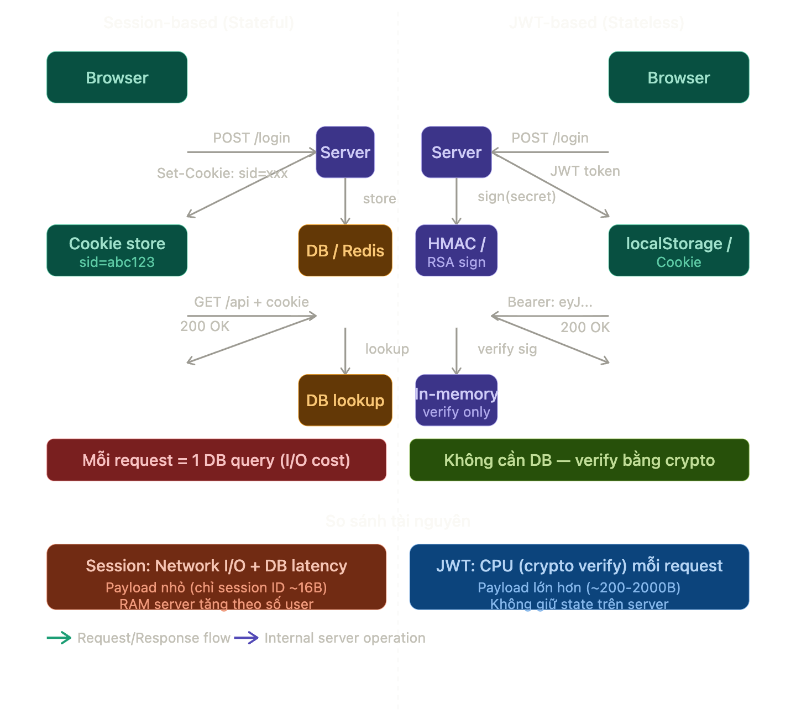

**Question 1:** JWT là gì? Cookie là gì? Session là gì? Ưa điểm? nhược điểm? Lúc nào nên ứng dụng, lúc nào không? Có ảnh hướng hiệu năng, tài nguyên máy tính không? Và ảnh hướng như thế nào nếu có. Nếu không ảnh hưởng tới tài nguyên máy tính thì ảnh hưởng tới gì?. Ví dụ.

**Answer:** Dưới đây là phân tích kỹ thuật chi tiết về ba cơ chế quản lý trạng thái người dùng phổ biến nhất trong web development: **Cookie**, **Session**, và **JWT**.

---

## Kiến trúc tổng quan

Trước hết, cần hiểu một nguyên lý nền tảng: **HTTP là stateless protocol** — mỗi request hoàn toàn độc lập, server không tự biết request đến từ ai. Cả ba cơ chế dưới đây đều là giải pháp để "mang trạng thái" vào một giao thức vốn không có trạng thái.



---

## 1. Cookie — Cơ chế lưu trữ phía client

**Cookie** về bản chất là một key-value store được browser tự động gắn vào mọi HTTP request tới cùng domain. Đây không phải cơ chế xác thực, mà là **transport mechanism** — nó chỉ là chiếc xe chở dữ liệu.

```http
# Server gửi xuống:
Set-Cookie: session_id=abc123; HttpOnly; Secure; SameSite=Strict; Max-Age=3600

# Browser tự động đính kèm trong mọi request sau:
Cookie: session_id=abc123
```

**Ưu điểm kỹ thuật:** Browser quản lý tự động (gửi/xóa/expire), `HttpOnly` flag ngăn JavaScript đọc cookie — giảm attack surface của XSS. `SameSite=Strict` chống CSRF.

**Nhược điểm kỹ thuật:** Chỉ hoạt động trên cùng domain (hoặc subdomain nếu dùng `Domain=.example.com`). Không dùng được cho cross-origin API calls mà không có CORS config cẩn thận. Bị block trong third-party context ở Safari (ITP). Giới hạn ~4KB per cookie.

**Ảnh hưởng tài nguyên:** Cookie bản thân không tốn tài nguyên server. Nhưng mỗi request tới domain đó đều tự động kèm cookie — kể cả request ảnh, CSS, font — gây ra **header bloat**. Với payload 500B cookie trên 100 sub-requests/trang, overhead tích lũy ~50KB chỉ riêng header.

---

## 2. Session — Cơ chế lưu trữ phía server

**Session** là pattern Stateful Authentication. Server cấp cho client một **opaque token** (session ID — thường là random string 128-bit), còn toàn bộ dữ liệu thực sự (user ID, role, permissions) được lưu server-side trong memory hoặc database.

Mỗi request từ browser bao gồm session cookie, và server xác thực bằng cách truy vấn database. Nếu hợp lệ, request được xử lý. Điểm mạnh là session record đóng vai trò centralized source of truth, việc thu hồi quyền truy cập rất nhanh bằng cách xóa hoặc vô hiệu hoá session record.

```python
# Pseudocode: Session flow
# Login
session_id = generate_random_token(128_bits)  # "abc123..."
db.set(f"session:{session_id}", {
    "user_id": 42,
    "roles": ["admin"],
    "expires": now + 3600
})
response.set_cookie("sid", session_id, httponly=True)

# Verify mỗi request
session_data = db.get(f"session:{request.cookie.sid}")  # ← I/O call
if not session_data or session_data.expires < now:
    return 401
```

**Ưu điểm:** Revocation tức thì (logout = xóa 1 record), server kiểm soát hoàn toàn vòng đời session, dữ liệu nhạy cảm không bao giờ ra client.

**Nhược điểm:** Phụ thuộc vào tương tác database cho mỗi lần validation có thể gây latency, đặc biệt cho high-traffic applications.

**Ảnh hưởng tài nguyên — đây là điểm quan trọng nhất:**

Mỗi active session chiếm RAM trên server (nếu dùng in-memory store như Redis) hoặc một row trong DB. Với 10,000 concurrent users, bạn cần 10,000 session records luôn available. Đây là lý do session-based authentication có vấn đề với **horizontal scaling**: nếu bạn có 3 server instance, request của user có thể đi vào server không có session của họ → cần **sticky session** hoặc **shared session store** (Redis cluster). JWT rất hấp dẫn vì nó stateless và có khả năng scale cao.

---

## 3. JWT (JSON Web Token) — Cơ chế self-contained token

JWT là open standard (RFC 7519) định nghĩa cách truyền thông tin giữa các bên một cách compact và self-contained dưới dạng JSON Object. Thông tin này có thể được xác minh và tin cậy vì được ký số (digitally signed).

Cấu trúc JWT gồm 3 phần phân tách bằng dấu `.`, mỗi phần được **Base64URL encode**:

```
eyJhbGciOiJIUzI1NiIsInR5cCI6IkpXVCJ9   ← Header (algorithm + type)
.eyJ1c2VyX2lkIjo0Miwicm9sZXMiOlsiYWRtaW4iXSwiZXhwIjoxNzA5MDAwMDAwfQ==  ← Payload
.SflKxwRJSMeKKF2QT4fwpMeJf36POk6yJV_adQssw5c  ← Signature
```

Payload sau khi decode:

```json
{
  "user_id": 42,
  "roles": ["admin"],
  "exp": 1709000000,
  "iat": 1708996400
}
```

Server verify bằng cách: tái tạo signature từ header + payload + secret key, so sánh với signature trong token. Nếu khớp → token hợp lệ. **Toàn bộ quá trình này xảy ra in-memory**, không có I/O.

**Ưu điểm kỹ thuật:** Stateless hoàn toàn — phù hợp microservices (service A có thể verify token mà không cần gọi sang service B). Cookie chỉ dùng được cho domain gốc, không hữu ích cho API trên domain khác. Dùng JWT đảm bảo RESTful API stateless, không cần quan tâm API và application được serve từ đâu.

**Nhược điểm kỹ thuật:** Vì JWT self-contained và hoạt động đến khi hết hạn, nên dù logout xảy ra, nếu ai đó lấy được token họ vẫn có thể dùng nó. Để tránh điều này, server cần duy trì một blacklist các token bị thu hồi — điều này đánh bại mục đích của stateless tokens. Đây là trade-off cốt lõi nhất của JWT.

---

## Ảnh hưởng hiệu năng và tài nguyên — phân tích chi tiết

Đây là phần quan trọng nhất. Ba cơ chế này ảnh hưởng đến **các loại tài nguyên khác nhau**, không phải cùng một loại.

**Session ảnh hưởng đến I/O và Memory:** Mỗi request cần 1 database read. Ở 10,000 RPS, đó là 10,000 DB queries/giây chỉ riêng cho authentication. Với Redis, latency ~0.1–1ms/query, vậy overhead là 1–10 giây tổng cộng mỗi giây — hay ~1% latency overhead. Tuy nhỏ, nhưng tích lũy đáng kể ở scale lớn.

Với Cookie authentication, backend phải thực hiện lookup đến SQL database hoặc NoSQL. Lookup này tốn nhiều thời gian hơn đáng kể so với decode một token. Tương tự, vì JWT có thể lưu thêm data như permission levels và roles, bạn tiết kiệm thời gian và tài nguyên cho các lookup calls khác.

**JWT ảnh hưởng đến CPU và Network bandwidth:** Verify JWT dùng HMAC-SHA256 (nếu dùng `HS256`) hoặc RSA/ECDSA (nếu dùng `RS256`/`ES256`). HMAC-SHA256 rất nhanh (~1–5 microseconds/operation), RSA-256 chậm hơn (~0.5–2ms). Nếu nhiều data được encode trong JWT, nó tạo ra lượng overhead đáng kể với mỗi HTTP request. Một JWT lớn (~2KB) gửi đi 1 triệu request/ngày = 2GB traffic chỉ riêng cho token.

**Nếu không ảnh hưởng tài nguyên trực tiếp, ảnh hưởng đến gì?** Điều quan trọng hơn là **security posture và operational complexity**: JWT không thể revoke ngay lập tức → window of vulnerability nếu token bị leak. Session phụ thuộc sticky routing → phức tạp hóa infrastructure. Cookie bị block cross-origin → giới hạn kiến trúc.

---

## Khi nào dùng cái nào?

**Dùng Session khi:** Bạn xây dựng monolithic web app cần revocation tức thì (banking, healthcare, hệ thống admin). User base vừa phải (<100K concurrent). Infrastructure cho phép shared session store.

**Dùng JWT khi:** Microservices hoặc distributed architecture — nhiều service cần verify token mà không gọi trung tâm. Dùng token khi xây dựng API service hoặc triển khai distributed systems. Cross-platform: vì stateless, token có thể dùng liền mạch trên mobile và IoT. Kết hợp với short expiry (~15 phút) + refresh token để giảm thiểu rủi ro revocation.

**Hybrid approach (best practice hiện đại):** Để cân bằng giữa hiệu năng của JWT và bảo mật của session cookie: một tổ chức cực kỳ nhạy cảm về bảo mật như ngân hàng có thể chỉ dùng session cookie để mọi call đều được authorize tức thì. Ứng dụng khác có thể muốn JWT verify phía client nhưng vẫn cần source of truth cho các action nhạy cảm.

Ví dụ thực tế: Google sử dụng JWT ngắn hạn (~1 giờ) cho API access, kết hợp với long-lived refresh token lưu server-side. Đây là mô hình được OAuth 2.0 chuẩn hóa — lấy được ưu điểm của cả hai phía.

===============

**Question 2:** Khi người ta gọi 2 khái niệm session và cookie thành một từ "session cookie", ý người ta là gì?

**Answer:** "Session cookie" là một thuật ngữ hay gây nhầm lẫn vì nó kết hợp hai từ mà người ta thường nghĩ là hai thứ riêng biệt. Thực ra khi nghe cụm này, bạn cần phân biệt **hai ngữ cảnh** hoàn toàn khác nhau mà người ta dùng nó.

---

## Ngữ cảnh 1: "Session cookie" theo nghĩa kỹ thuật của browser

Đây là nghĩa gốc, thuần túy từ góc độ HTTP/browser. Trong thế giới browser, mọi cookie đều có một thuộc tính kiểm soát vòng đời của nó:

```http
Set-Cookie: theme=dark; Max-Age=86400   ← "Persistent cookie": tồn tại 86400 giây
Set-Cookie: theme=dark; Expires=...     ← "Persistent cookie": tồn tại đến ngày cụ thể

Set-Cookie: theme=dark                  ← "Session cookie": KHÔNG có Max-Age hay Expires
```

Khi một cookie **không có `Max-Age` và không có `Expires`**, browser coi nó là **session cookie** — nghĩa là cookie chỉ tồn tại trong phiên làm việc hiện tại của browser tab/window. Khi người dùng đóng trình duyệt, cookie bị xóa tự động. Nó không được ghi vào disk, chỉ tồn tại trong RAM của browser.

Trong ngữ cảnh này, "session" không liên quan gì đến server-side session. Nó chỉ mô tả **thời gian sống** của cookie — sống cùng "session" của browser, chết khi browser đóng.

---

## Ngữ cảnh 2: "Session cookie" theo nghĩa của authentication pattern

Đây là nghĩa phổ biến hơn khi developer nói chuyện với nhau về authentication. Ở đây, "session cookie" có nghĩa là: **một cookie được dùng để vận chuyển session ID** — tức là nó là chiếc xe chở cái opaque token `sid=abc123` từ client lên server để server tra cứu session.

Nói cách khác, người ta đang nói tắt của cả một pattern:

```
"Session cookie" = Cookie (transport) + Session (storage pattern)
                 = [Cookie chứa session ID] + [Server lưu dữ liệu thực sự]
```

Khi ai đó nói _"app này dùng session cookie để authenticate"_, họ đang mô tả toàn bộ cơ chế: server tạo session, lưu data server-side, rồi gửi session ID xuống client **thông qua cookie**.

---

## Cách phân biệt ngữ cảnh trong thực tế

Một điểm hay để nhớ: hai nghĩa này hoàn toàn có thể kết hợp, và thực tế hay gặp nhất là **session cookie theo cả hai nghĩa cùng lúc**:

```http
Set-Cookie: sid=abc123; HttpOnly; Secure; SameSite=Strict
             ↑                                              ↑
    chứa session ID                               KHÔNG có Max-Age
    → nghĩa số 2                                  → nghĩa số 1
```

Cookie trên vừa là "session cookie" theo nghĩa browser (biến mất khi đóng tab), vừa là "session cookie" theo nghĩa authentication (chở session ID). Đây là pattern phổ biến nhất cho các web app truyền thống — bạn muốn user phải login lại mỗi khi đóng browser.

Ngược lại, nếu muốn chức năng "remember me", server sẽ thêm `Max-Age` vào:

```http
Set-Cookie: sid=abc123; HttpOnly; Secure; Max-Age=2592000
```

Lúc này cookie **không còn là "session cookie"** theo nghĩa browser nữa (nó là persistent cookie), nhưng pattern xác thực vẫn là session-based. Đây là lúc hai nghĩa tách ra.

---

Tóm lại, khi ai đó dùng từ "session cookie", gần như chắc chắn họ muốn nói đến **ngữ cảnh số 2** — cái pattern dùng cookie để chở session ID, phân biệt với JWT. Còn nghĩa số 1 (vòng đời của cookie trong browser) thường được đề cập khi nói về UX như "user có cần login lại sau khi đóng tab không" — ít gặp hơn trong các cuộc thảo luận về kiến trúc authentication.

===============

**Question 3:** Các cách lưu JWT phía Client? Những ảnh hưởng của từng cách? Nên chọn cách nào? Ví dụ.

**Answer:** Việc lưu trữ JSON Web Token (JWT) phía Client là một bài toán đánh đổi giữa **Tiện lợi (Convenience)** và **Bảo mật (Security)**. Có 3 phương pháp phổ biến nhất trong kiến trúc ứng dụng web hiện nay:

---

## 1. LocalStorage / SessionStorage

Đây là cách phổ biến nhất vì tính đơn giản trong triển khai.

- **Cơ chế:** Token được lưu dưới dạng Key-Value trong bộ nhớ trình duyệt. Khi gọi API, lập trình viên code JS để lấy token và gắn vào header `Authorization: Bearer <token>`.
- **Ảnh hưởng:**
  - **Ưu điểm:** Dễ dùng, không cần cấu hình phía server quá phức tạp, tránh được tấn công **CSRF (Cross-Site Request Forgery)** tự động vì trình duyệt không tự gửi token này đi.
  - **Nhược điểm:** Cực kỳ dễ bị tấn công **XSS (Cross-Site Scripting)**. Nếu hacker chèn được một đoạn mã script (qua một thư viện bên thứ 3 hoặc input không được sanitize), chúng có thể đọc sạch sẽ token bằng lệnh `localStorage.getItem()`.

---

## 2. HttpOnly Cookie (Khuyên dùng)

Đây là phương pháp bảo mật tiêu chuẩn cho các ứng dụng web hiện đại.

- **Cơ chế:** Server gửi token qua header `Set-Cookie` với flag `HttpOnly`.
- **Ảnh hưởng:**
  - **Ưu điểm:** Ngăn chặn hoàn toàn việc truy cập token bằng JavaScript. Ngay cả khi ứng dụng bị dính lỗi XSS, hacker cũng không thể dùng `document.cookie` để lấy token.
  - **Nhược điểm:** Dễ bị tấn công **CSRF**. Trình duyệt sẽ tự động đính kèm cookie này vào mọi request gửi tới domain đó.
  - **Giải pháp đi kèm:** Phải sử dụng flag `SameSite=Strict` hoặc `SameSite=Lax` và đính kèm **Anti-CSRF Token**.

---

## 3. In-Memory (Bộ nhớ tạm của ứng dụng)

Thường dùng kết hợp với kiến trúc **Refresh Token**.

- **Cơ chế:** Lưu Access Token vào một biến (variable) trong ứng dụng (React State, Vuex, Redux). Khi F5 hoặc đóng tab, token sẽ mất.
- **Ảnh hưởng:**
  - **Ưu điểm:** Bảo mật nhất vì không lưu vết trên ổ cứng hay bộ nhớ lâu dài của trình duyệt.
  - **Nhược điểm:** Phải thực hiện cơ chế "Silent Refresh" (dùng một Refresh Token lưu trong HttpOnly Cookie để lấy Access Token mới) mỗi khi người dùng tải lại trang.

---

## Bảng so sánh kỹ thuật

| Tiêu chí                 | LocalStorage            | HttpOnly Cookie     | In-Memory                |
| :----------------------- | :---------------------- | :------------------ | :----------------------- |
| **Truy cập bởi JS**      | Có (Nguy hiểm XSS)      | **Không** (An toàn) | Có                       |
| **Tự động gửi đi**       | Không                   | Có (Nguy cơ CSRF)   | Không                    |
| **Độ bền (Persistence)** | Vĩnh viễn (đến khi xóa) | Tùy chỉnh (Expires) | Mất khi reload trang     |
| **Độ khó triển khai**    | Rất dễ                  | Trung bình          | Khó (Cần Silent Refresh) |

---

## Lời khuyên: Nên chọn cách nào?

**Phương án tối ưu (Best Practice 2026):**
Kết hợp **HttpOnly Cookie** cho **Refresh Token** và **In-Memory** cho **Access Token**.

1.  **Access Token (ngắn hạn):** Lưu trong bộ nhớ JavaScript (Variable).
2.  **Refresh Token (dài hạn):** Lưu trong Cookie với các flag: `HttpOnly`, `Secure` (chỉ chạy HTTPS), `SameSite=Strict`.

---

## Ví dụ Demo (ASP.NET Core & TypeScript)

### Cấu hình phía Server (C#)

Khi User đăng nhập thành công, Server trả về Cookie chứa Refresh Token và JSON chứa Access Token.

```csharp
public IActionResult Login()
{
    var accessToken = GenerateJwtToken(user, exp: 15); // 15 phút
    var refreshToken = GenerateRefreshToken(); // 7 ngày

    // Lưu Refresh Token vào Cookie bảo mật
    Response.Cookies.Append("refreshToken", refreshToken, new CookieOptions
    {
        HttpOnly = true,
        Secure = true, // Chỉ gửi qua HTTPS
        SameSite = SameSiteMode.Strict,
        Expires = DateTime.UtcNow.AddDays(7)
    });

    return Ok(new { token = accessToken });
}
```

### Cấu hình phía Client (TypeScript)

Access token được lưu vào một biến cục bộ thay vì LocalStorage.

```typescript
// authService.ts
let _accessToken: string | null = null;

export const setAccessToken = (token: string) => {
  _accessToken = token;
};

export const getAccessToken = () => _accessToken;

// Axios Interceptor để tự động gắn token vào header
axios.interceptors.request.use((config) => {
  const token = getAccessToken();
  if (token) {
    config.headers.Authorization = `Bearer ${token}`;
  }
  return config;
});
```

**Giải thích:** Với cách tiếp cận này, nếu hacker dùng XSS, chúng không lấy được Refresh Token (vì `HttpOnly`). Nếu chúng lấy được Access Token trong bộ nhớ, thiệt hại cũng cực nhỏ vì token này sẽ hết hạn chỉ sau vài phút.

===============

**Question 4:** LocalStorage với SessionStorage khác gì nhau?

**Answer:** Trong kiến trúc trình duyệt, cả **LocalStorage** và **SessionStorage** đều thuộc Web Storage API, cho phép lưu trữ dữ liệu dưới dạng Key-Value (chuỗi) với dung lượng lớn hơn Cookie (thường khoảng 5MB).

Tuy nhiên, sự khác biệt cốt yếu nằm ở **Scope (Phạm vi)** và **Lifetime (Vòng đời)** của dữ liệu.

---

## 1. So sánh chi tiết

| Đặc tính                | LocalStorage                                                                                       | SessionStorage                                                                                    |
| :---------------------- | :------------------------------------------------------------------------------------------------- | :------------------------------------------------------------------------------------------------ |
| **Vòng đời (Lifetime)** | Dữ liệu tồn tại vĩnh viễn cho đến khi bị xóa bởi JavaScript hoặc người dùng xóa Cache trình duyệt. | Dữ liệu bị xóa ngay lập tức khi **Tab** hoặc **Cửa sổ** trình duyệt bị đóng.                      |
| **Phạm vi (Scope)**     | Chia sẻ giữa tất cả các Tab và Cửa sổ có cùng **Origin** (Domain/Protocol/Port).                   | Chỉ tồn tại trong phạm vi **duy nhất một Tab**. Mở tab mới cùng URL sẽ tạo ra SessionStorage mới. |
| **Dung lượng**          | Khoảng 5MB - 10MB (tùy trình duyệt).                                                               | Khoảng 5MB.                                                                                       |
| **Phía Server**         | Server không thể truy cập trực tiếp.                                                               | Server không thể truy cập trực tiếp.                                                              |

---

## 2. Phân tích dưới góc độ kỹ thuật

### Vòng đời của SessionStorage

Một điểm gây nhầm lẫn phổ biến là việc "Reload" trang.

- Nếu bạn **F5 (Reload)**: Dữ liệu trong `sessionStorage` vẫn được giữ nguyên.
- Nếu bạn **Duplicate Tab**: Dữ liệu từ Tab cũ sẽ được copy sang Tab mới, nhưng sau đó hai Tab này hoạt động độc lập.
- Nếu bạn **Đóng Tab rồi mở lại**: Dữ liệu mất hoàn toàn.

### Vòng đời của LocalStorage

Dữ liệu được ghi xuống đĩa cứng (Disk). Ngay cả khi bạn tắt máy, mở lại trình duyệt sau một tuần, dữ liệu vẫn còn đó. Điều này khiến nó trở thành nơi lưu trữ lý tưởng cho các cài đặt người dùng (ví dụ: Dark Mode, ngôn ngữ mặc định).

---

## 3. Ví dụ minh họa bằng TypeScript

Giả sử bạn đang xây dựng một ứng dụng thương mại điện tử:

### Trường hợp dùng LocalStorage: Lưu giỏ hàng (Cart)

Người dùng muốn sản phẩm vẫn còn trong giỏ khi họ quay lại vào ngày mai.

```typescript
const saveCart = (items: any[]) => {
  localStorage.setItem("shopping_cart", JSON.stringify(items));
};

const getCart = () => {
  const data = localStorage.getItem("shopping_cart");
  return data ? JSON.parse(data) : [];
};
```

### Trường hợp dùng SessionStorage: Lưu trạng thái bộ lọc (Filter)

Người dùng đang tìm kiếm ở Tab A với bộ lọc "Giá thấp", nhưng ở Tab B họ muốn tìm theo "Mới nhất". Việc dùng `sessionStorage` giúp các Tab không bị ghi đè dữ liệu của nhau.

```typescript
const saveCurrentFilter = (filter: string) => {
  sessionStorage.setItem("current_search_filter", filter);
};
```

---

## 4. Ảnh hưởng đến bảo mật (Security Implications)

Cả hai đều có cùng một lỗ hổng bảo mật nghiêm trọng: **XSS (Cross-Site Scripting)**.

- Vì cả hai đều có thể truy cập được thông qua JavaScript (`window.localStorage` hoặc `window.sessionStorage`), bất kỳ script độc hại nào được thực thi trên trang cũng có thể lấy cắp toàn bộ thông tin này.
- **Lời khuyên:** Tuyệt đối không lưu các thông tin nhạy cảm như mật khẩu, thông tin thẻ tín dụng, hoặc các dữ liệu định danh quan trọng vào đây trừ khi đã có phương án mã hóa hoặc đảm bảo môi trường thực thi an toàn.

===============

**Question 5:** Các cách để invalidate JWT token? Nên chọn cách nào? Cung cấp code cho kỹ thuật này

**Answer:** Để giải quyết bài toán này một cách chuyên nghiệp, chúng ta sẽ sử dụng mô hình **Refresh Token Rotation**. Quy trình này đảm bảo:

1.  **Access Token** ngắn hạn (lưu trong bộ nhớ ứng dụng).
2.  **Refresh Token** dài hạn (lưu trong **HttpOnly Cookie** và Database).
3.  Mỗi khi dùng Refresh Token để lấy Access Token mới, Refresh Token cũ sẽ bị xóa hoặc thay thế (Rotation) để tránh replay attack.

---

## 1. Cấu trúc Database (Entity)

Bạn cần một bảng để lưu trữ Refresh Token nhằm mục đích kiểm soát và thu hồi.

```csharp
public class UserRefreshToken
{
    public int Id { get; set; }
    public string Token { get; set; }
    public string JwtId { get; set; } // Liên kết với JTI của Access Token
    public string UserId { get; set; }
    public DateTime ExpiryDate { get; set; }
    public bool IsRevoked { get; set; }
}
```

---

## 2. Quy trình phát hành và lưu Refresh Token (Login)

Tại đây, ta tạo Access Token trả về JSON và Refresh Token trả về qua Cookie.

```csharp
[HttpPost("login")]
public async Task<IActionResult> Login([FromBody] LoginModel model)
{
    var user = await _userManager.FindByEmailAsync(model.Email);
    if (user == null || !await _userManager.CheckPasswordAsync(user, model.Password))
        return Unauthorized();

    var accessToken = GenerateAccessToken(user);
    var refreshToken = GenerateRefreshToken();

    // Lưu Refresh Token vào Database
    var userRefreshToken = new UserRefreshToken
    {
        Token = refreshToken,
        UserId = user.Id,
        ExpiryDate = DateTime.UtcNow.AddDays(7),
        IsRevoked = false
    };
    _context.UserRefreshTokens.Add(userRefreshToken);
    await _context.SaveChangesAsync();

    // Gửi Refresh Token qua HttpOnly Cookie
    Response.Cookies.Append("X-Refresh-Token", refreshToken, new CookieOptions
    {
        HttpOnly = true,
        Secure = true,
        SameSite = SameSiteMode.Strict,
        Expires = DateTime.UtcNow.AddDays(7)
    });

    return Ok(new { token = accessToken });
}
```

---

## 3. Quy trình đổi Access Token mới (Refresh)

Client sẽ gọi API này khi Access Token hết hạn (thường bắt lỗi 401 ở interceptor).

```csharp
[HttpPost("refresh-token")]
public async Task<IActionResult> Refresh()
{
    // 1. Lấy Refresh Token từ Cookie
    var refreshToken = Request.Cookies["X-Refresh-Token"];
    if (string.IsNullOrEmpty(refreshToken)) return Unauthorized();

    // 2. Kiểm tra Refresh Token trong DB
    var storedToken = await _context.UserRefreshTokens
        .FirstOrDefaultAsync(x => x.Token == refreshToken && !x.IsRevoked);

    if (storedToken == null || storedToken.ExpiryDate < DateTime.UtcNow)
        return Unauthorized("Invalid or expired refresh token");

    // 3. Xóa (hoặc vô hiệu hóa) token cũ - Kỹ thuật Rotation
    _context.UserRefreshTokens.Remove(storedToken);

    // 4. Tạo cặp token mới
    var user = await _userManager.FindByIdAsync(storedToken.UserId);
    var newAccessToken = GenerateAccessToken(user);
    var newRefreshToken = GenerateRefreshToken();

    // 5. Lưu token mới vào DB và cập nhật Cookie
    _context.UserRefreshTokens.Add(new UserRefreshToken {
        Token = newRefreshToken,
        UserId = user.Id,
        ExpiryDate = DateTime.UtcNow.AddDays(7)
    });
    await _context.SaveChangesAsync();

    Response.Cookies.Append("X-Refresh-Token", newRefreshToken, new CookieOptions {
        HttpOnly = true, Secure = true, SameSite = SameSiteMode.Strict
    });

    return Ok(new { token = newAccessToken });
}
```

---

## 4. Quy trình xóa Refresh Token (Logout)

Khi logout, ta phải xóa sạch cả ở Database và xóa Cookie ở trình duyệt.

```csharp
[HttpPost("logout")]
[Authorize]
public async Task<IActionResult> Logout()
{
    var refreshToken = Request.Cookies["X-Refresh-Token"];

    if (!string.IsNullOrEmpty(refreshToken))
    {
        // 1. Xóa khỏi Database
        var storedToken = await _context.UserRefreshTokens
            .FirstOrDefaultAsync(x => x.Token == refreshToken);

        if (storedToken != null)
        {
            _context.UserRefreshTokens.Remove(storedToken);
            await _context.SaveChangesAsync();
        }
    }

    // 2. Xóa Cookie ở trình duyệt bằng cách đặt Expired về quá khứ
    Response.Cookies.Delete("X-Refresh-Token");

    return Ok(new { message = "Logged out" });
}
```

---

## 5. Xử lý phía Client (TypeScript/Axios)

Sử dụng Interceptor để tự động refresh khi gặp lỗi 401.

```typescript
import axios from "axios";

const api = axios.create({ baseURL: "/api" });

api.interceptors.response.use(
  (response) => response,
  async (error) => {
    const originalRequest = error.config;

    // Nếu lỗi 401 và chưa từng thử refresh
    if (error.response.status === 401 && !originalRequest._retry) {
      originalRequest._retry = true;
      try {
        // Gọi API refresh (Cookie tự động được gửi kèm)
        const res = await axios.post("/api/auth/refresh-token");
        const { token } = res.data;

        // Cập nhật token mới vào header và bộ nhớ
        api.defaults.headers.common["Authorization"] = `Bearer ${token}`;
        return api(originalRequest);
      } catch (refreshError) {
        // Nếu refresh cũng fail (hết hạn 7 ngày) -> Logout
        window.location.href = "/login";
        return Promise.reject(refreshError);
      }
    }
    return Promise.reject(error);
  },
);
```

### Tại sao quy trình này an toàn?

- **Database check:** Nếu tài khoản người dùng bị khóa hoặc đổi mật khẩu, bạn có thể xóa tất cả Refresh Token trong DB, buộc họ phải đăng nhập lại ngay lập tức.
- **HttpOnly Cookie:** Script độc hại không thể `console.log` để lấy Refresh Token.
- **Rotation:** Nếu hacker trộm được Refresh Token và dùng nó, khi người dùng thật dùng lại token đó, Server sẽ phát hiện Token đã bị xóa/thay đổi và có thể cảnh báo tấn công.
