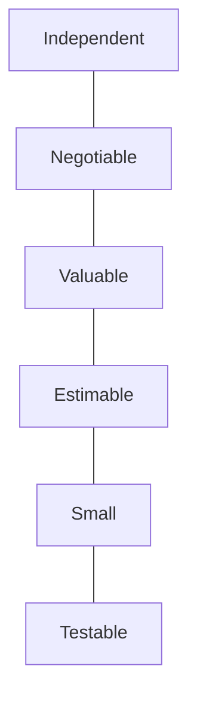

# Agile Methodology - Advance Q&A

en: This file contains advanced questions and answers about Agile Methodology, focusing on scaling, metrics, and complex practices.
vi: Tệp này chứa các câu hỏi và câu trả lời nâng cao về Phương pháp luận Agile, tập trung vào việc mở rộng (scaling), các chỉ số (metrics) và các thực hành phức tạp.

---

## INVEST Criteria for User Stories

---

### Question 1
en: What is the "Empirical Process Control" in Scrum and what are its three pillars?
vi: "Kiểm soát Quy trình Thực nghiệm" (Empirical Process Control) trong Scrum là gì và ba trụ cột của nó là gì?

en: **Answer**: Empirical process control relies on making decisions based on observed facts and experience rather than prediction. Its three pillars are:
1. **Transparency**: The process and work must be visible to those performing the work and those receiving it.
2. **Inspection**: Frequent inspection of Scrum artifacts and progress toward a goal to detect undesirable variances.
3. **Adaptation**: If an inspector determines that one or more aspects of a process deviate outside acceptable limits, the process or the material being processed must be adjusted.
vi: **Trả lời**: Kiểm soát quy trình thực nghiệm dựa trên việc đưa ra quyết định dựa trên các sự thật quan sát được và kinh nghiệm thay vì dự đoán. Ba trụ cột của nó là:
1. **Tính minh bạch (Transparency)**: Quy trình và công việc phải được hiển thị rõ ràng cho những người thực hiện và những người tiếp nhận kết quả.
2. **Sự kiểm tra (Inspection)**: Thường xuyên kiểm tra các tạo tác (artifacts) Scrum và tiến độ hướng tới mục tiêu để phát hiện các sai lệch không mong muốn.
3. **Sự thích nghi (Adaptation)**: Nếu người kiểm tra xác định rằng một hoặc nhiều khía cạnh của quy trình bị lệch ra ngoài giới hạn cho phép, quy trình hoặc vật liệu đang được xử lý phải được điều chỉnh.

---

### Question 2
en: Explain the INVEST criteria for writing high-quality User Stories.
vi: Giải thích tiêu chí INVEST để viết các Câu chuyện người dùng (User Stories) chất lượng cao.

en: **Answer**: INVEST is an acronym that stands for:
- **I (Independent)**: Stories should be self-contained and not depend on others.
- **N (Negotiable)**: Stories are not fixed contracts; they invite discussion.
- **V (Valuable)**: Each story must deliver value to the user/customer.
- **E (Estimable)**: The team must be able to estimate the effort required.
- **S (Small)**: Stories should be small enough to be completed within a Sprint.
- **T (Testable)**: There must be a way to verify that the story is completed.
vi: **Trả lời**: INVEST là chữ viết tắt của:
- **I (Independent - Độc lập)**: Các câu chuyện nên độc lập và không phụ thuộc vào nhau.
- **N (Negotiable - Có thể thương lượng)**: Câu chuyện không phải là hợp đồng cố định; chúng mở ra sự thảo luận.
- **V (Valuable - Có giá trị)**: Mỗi câu chuyện phải mang lại giá trị cho người dùng/khách hàng.
- **E (Estimable - Có thể ước tính)**: Nhóm phải có khả năng ước tính nỗ lực cần thiết.
- **S (Small - Nhỏ)**: Câu chuyện nên đủ nhỏ để có thể hoàn thành trong một Sprint.
- **T (Testable - Có thể kiểm thử)**: Phải có cách để xác minh rằng câu chuyện đã hoàn thành.

---

### Question 3
en: What are some common Agile Scaling Frameworks, and when should they be used?
vi: Các Khung mở rộng Agile (Agile Scaling Frameworks) phổ biến là gì và khi nào nên sử dụng chúng?

en: **Answer**: Common frameworks include **SAFe** (Scaled Agile Framework), **LeSS** (Large-Scale Scrum), and **Scrum@Scale**. 
- **SAFe**: Best for large enterprises requiring structured synchronization across many departments and hundreds of people.
- **LeSS**: Best for organizations that want to keep things simple and apply Scrum principles as-is to a larger number of teams.
- **Scrum@Scale**: Focuses on a modular approach where the organization is a "network of Scrum teams".
vi: **Trả lời**: Các khung phổ biến bao gồm **SAFe** (Scaled Agile Framework), **LeSS** (Large-Scale Scrum), và **Scrum@Scale**.
- **SAFe**: Tốt nhất cho các doanh nghiệp lớn yêu cầu sự đồng bộ hóa có cấu trúc giữa nhiều bộ phận và hàng trăm con người.
- **LeSS**: Tốt nhất cho các tổ chức muốn giữ mọi thứ đơn giản và áp dụng các nguyên tắc Scrum nguyên bản cho một số lượng lớn các nhóm.
- **Scrum@Scale**: Tập trung vào cách tiếp cận theo mô-đun, nơi tổ chức là một "mạng lưới các nhóm Scrum".

---

### Question 4
en: Explain the concepts of Cycle Time and Lead Time in Agile metrics.
vi: Giải thích các khái niệm Thời gian chu kỳ (Cycle Time) và Thời gian chờ (Lead Time) trong các chỉ số Agile.

en: **Answer**: 
- **Lead Time**: The total time from the moment a request is made until it is delivered to the customer. It measures the customer's experience.
- **Cycle Time**: The time it takes to complete a task once work has actually started on it. It measures the velocity of the internal development process.
vi: **Trả lời**:
- **Lead Time (Thời gian chờ)**: Tổng thời gian từ thời điểm yêu cầu được đưa ra cho đến khi nó được bàn giao cho khách hàng. Nó đo lường trải nghiệm của khách hàng.
- **Cycle Time (Thời gian chu kỳ)**: Thời gian cần thiết để hoàn thành một nhiệm vụ kể từ khi công việc thực sự bắt đầu trên đó. Nó đo lường tốc độ của quy trình phát triển nội bộ.

---

### Question 5
en: How do you handle Technical Debt in an Agile environment?
vi: Bạn xử lý Nợ kỹ thuật (Technical Debt) như thế nào trong môi trường Agile?

en: **Answer**: Technical debt should be made visible in the Product Backlog. Strategies include:
1. **Refactoring as part of "Done"**: Ensuring high quality in every Sprint.
2. **Dedicated capacity**: Allocating 10-20% of Sprint capacity to clearing debt.
3. **Specific debt items**: Creating backlog items specifically for major refactoring.
vi: **Trả lời**: Nợ kỹ thuật cần phải được làm cho minh bạch trong Product Backlog. Các chiến lược bao gồm:
1. **Tái cấu trúc (Refactoring) như một phần của "Hoàn thành"**: Đảm bảo chất lượng cao trong mọi Sprint.
2. **Dành riêng năng lực**: Phân bổ 10-20% năng lực của Sprint để xử lý nợ.
3. **Các mục nợ cụ thể**: Tạo các hạng mục backlog dành riêng cho việc tái cấu trúc lớn.

---

### Question 6
en: What is "Servant Leadership" in the context of a Scrum Master?
vi: "Lãnh đạo phục vụ" (Servant Leadership) trong bối cảnh của một Scrum Master là gì?

en: **Answer**: A Scrum Master is a servant-leader, meaning they serve the team by removing impediments, facilitating events, and coaching the organization. They lead without formal authority, focusing on the team's growth and well-being to achieve project goals.
vi: **Trả lời**: Một Scrum Master là một người lãnh đạo phục vụ, nghĩa là họ phục vụ nhóm bằng cách loại bỏ các trở ngại, điều phối các sự kiện và huấn luyện tổ chức. Họ lãnh đạo mà không cần quyền lực chính thức, tập trung vào sự phát triển và hạnh phúc của nhóm để đạt được các mục tiêu dự án.

---

### Question 7
en: Explain the "Agile Fluency Model".
vi: Giải thích "Mô hình Độ thuần thục Agile" (Agile Fluency Model).

en: **Answer**: The Agile Fluency Model describes the path teams take as they develop Agile skills. It has four zones:
1. **Focusing**: Teams learn to think in terms of business value.
2. **Delivering**: Teams learn technical practices to release frequently.
3. **Optimizing**: Teams learn to make better business decisions.
4. **Strengthening**: Teams learn to contribute to organizational culture.
vi: **Trả lời**: Mô hình Độ thuần thục Agile mô tả con đường mà các nhóm đi qua khi họ phát triển các kỹ năng Agile. Nó có bốn vùng:
1. **Tập trung (Focusing)**: Các nhóm học cách tư duy theo định hướng giá trị kinh doanh.
2. **Bàn giao (Delivering)**: Các nhóm học các thực hành kỹ thuật để phát hành thường xuyên.
3. **Tối ưu hóa (Optimizing)**: Các nhóm học cách đưa ra các quyết định kinh doanh tốt hơn.
4. **Tăng cường (Strengthening)**: Các nhóm học cách đóng góp vào văn hóa tổ chức.

---

### Question 8
en: What are the key practices of Extreme Programming (XP) that complement Scrum?
vi: Các thực hành chính của Extreme Programming (XP) bổ trợ cho Scrum là gì?

en: **Answer**: Key XP practices include **Test-Driven Development (TDD)**, **Pair Programming**, **Continuous Integration (CI)**, **Refactoring**, and **Simple Design**. While Scrum provides the management framework, XP provide the technical excellence needed to be truly Agile.
vi: **Trả lời**: Các thực hành XP chính bao gồm **Phát triển hướng kiểm thử (TDD)**, **Lập trình cặp (Pair Programming)**, **Tích hợp liên tục (CI)**, **Tái cấu trúc (Refactoring)**, và **Thiết kế đơn giản (Simple Design)**. Trong khi Scrum cung cấp khung quản lý, XP cung cấp sự xuất sắc về kỹ thuật cần thiết để thực sự trở thành Agile.

---

### Question 9
en: How do you estimate in Agile projects (e.g., Story Points vs Hours)?
vi: Bạn ước tính như thế nào trong các dự án Agile (ví dụ: Story Points so với Giờ)?

en: **Answer**: Agile teams often use **Story Points** based on relative sizing (Fibonacci sequence) to account for complexity, effort, and risk, rather than absolute hours. This avoids the pitfalls of precise time estimation and focuses on the team's capacity (velocity).
vi: **Trả lời**: Các nhóm Agile thường sử dụng **Story Points** dựa trên việc phân cỡ tương đối (dãy Fibonacci) để tính đến độ phức tạp, nỗ lực và rủi ro, thay vì số giờ tuyệt đối. Điều này tránh được những cạm bẫy của việc ước tính thời gian chính xác và tập trung vào năng lực (vận tốc) của nhóm.

---

### Question 10
en: What is the concept of "Psychological Safety" and why is it critical for Agile teams?
vi: Khái niệm "An toàn tâm lý" (Psychological Safety) là gì và tại sao nó lại quan trọng đối với các nhóm Agile?

en: **Answer**: Psychological safety is the belief that one will not be punished or humiliated for speaking up with ideas, questions, concerns, or mistakes. In Agile, it is critical for authentic Retrospectives, transparency, and the continuous learning necessary for adaptation.
vi: **Trả lời**: An toàn tâm lý là niềm tin rằng một người sẽ không bị trừng phạt hay hạ thấp khi đưa ra các ý tưởng, câu hỏi, lo ngại hoặc sai lầm. Trong Agile, nó cực kỳ quan trọng đối với những buổi Retrospective thực chất, tính minh bạch và sự học hỏi liên tục cần thiết cho việc thích nghi.
