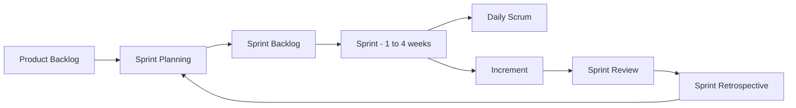

# Agile Methodology - Foundation Q&A

en: This file contains foundational questions and answers about Agile Methodology.
vi: Tệp này chứa các câu hỏi và câu trả lời cơ bản về Phương pháp luận Agile.

---

## Scrum Process Overview

---

### Question 1
en: What is Agile Methodology and how does it differ from the Waterfall model?
vi: Phương pháp luận Agile là gì và nó khác với mô hình Thác nước (Waterfall) như thế nào?

en: **Answer**: Agile is an iterative and incremental approach to software development that focuses on customer feedback and rapid releases. Unlike Waterfall, which is linear and sequential (Plan -> Design -> Build -> Test -> Deploy), Agile encourages flexibility and changes even late in the development process.
vi: **Trả lời**: Agile là một cách tiếp cận lặp lại (iterative) và tăng trưởng (incremental) trong phát triển phần mềm, tập trung vào phản hồi của khách hàng và việc phát hành nhanh chóng. Khác với Waterfall vốn có tính tuyến tính và tuần tự (Lập kế hoạch -> Thiết kế -> Xây dựng -> Kiểm thử -> Triển khai), Agile khuyến khích sự linh hoạt và các thay đổi ngay cả ở giai đoạn cuối của quá trình phát triển.

---

### Question 2
en: What are the four core values of the Agile Manifesto?
vi: Bốn giá trị cốt lõi của Tuyên ngôn Agile (Agile Manifesto) là gì?

en: **Answer**: 
1. Individuals and interactions over processes and tools.
2. Working software over comprehensive documentation.
3. Customer collaboration over contract negotiation.
4. Responding to change over following a plan.
vi: **Trả lời**:
1. Cá nhân và tương tác hơn là quy trình và công cụ.
2. Phần mềm chạy tốt hơn là tài liệu đầy đủ.
3. Cộng tác với khách hàng hơn là đàm phán hợp đồng.
4. Phản hồi với thay đổi hơn là bám sát kế hoạch.

---

### Question 3
en: What are the three main roles in a Scrum team?
vi: Ba vai trò chính trong một nhóm Scrum là gì?

en: **Answer**: 
1. **Product Owner**: Responsible for maximizing value and managing the Product Backlog.
2. **Scrum Master**: Responsible for promoting and supporting Scrum, helping everyone understand Scrum theory and practices.
3. **Development Team**: Professionals who do the work of delivering a releasable Increment of "Done" product at the end of each Sprint.
vi: **Trả lời**:
1. **Product Owner (Chủ sở hữu sản phẩm)**: Chịu trách nhiệm tối đa hóa giá trị và quản lý Danh mục sản phẩm (Product Backlog).
2. **Scrum Master (Điều phối viên Scrum)**: Chịu trách nhiệm thúc đẩy và hỗ trợ Scrum, giúp mọi người hiểu lý thuyết và thực hành Scrum.
3. **Development Team (Nhóm phát triển)**: Các chuyên gia thực hiện công việc để bàn giao một Phần tăng trưởng (Increment) sản phẩm "Hoàn thành" có thể phát hành được vào cuối mỗi Sprint.

---

### Question 4
en: What is a Sprint in Scrum?
vi: Sprint trong Scrum là gì?

en: **Answer**: A Sprint is a fixed-length event of one month or less to create a consistent cadence. It is a time-boxed iteration during which a "Done", useable, and potentially releasable product Increment is created.
vi: **Trả lời**: Sprint là một sự kiện có độ dài cố định từ một tháng trở xuống để tạo ra một nhịp độ nhất quán. Nó là một vòng lặp giới hạn thời gian (time-boxed) mà trong đó một Phần tăng trưởng sản phẩm "Hoàn thành", có thể sử dụng và có khả năng phát hành được tạo ra.

---

### Question 5
en: What is the purpose of the Daily Standup (Daily Scrum)?
vi: Mục đích của buổi họp Daily Standup (Daily Scrum) là gì?

en: **Answer**: The purpose is to inspect progress toward the Sprint Goal and adapt the Sprint Backlog as necessary, adjusting the upcoming planned work. It is a 15-minute event for the developers to synchronize activities and create a plan for the next 24 hours.
vi: **Trả lời**: Mục đích là để kiểm tra tiến độ hướng tới Mục tiêu Sprint (Sprint Goal) và điều chỉnh Sprint Backlog nếu cần thiết, sắp xếp lại công việc đã lập kế hoạch sắp tới. Đây là một sự kiện kéo dài 15 phút để các thành viên phát triển đồng bộ hóa các hoạt động và lập kế hoạch cho 24 giờ tới.

---

### Question 6
en: What is the "Definition of Done" (DoD)?
vi: "Định nghĩa về sự Hoàn thành" (Definition of Done - DoD) là gì?

en: **Answer**: The Definition of Done is a formal description of the state of the Increment when it meets the quality measures required for the product. It ensures transparency and shared understanding of what work was completed.
vi: **Trả lời**: Định nghĩa về sự Hoàn thành là một mô tả chính thức về trạng thái của Phần tăng trưởng khi nó đáp ứng các tiêu chuẩn chất lượng yêu cầu cho sản phẩm. Nó đảm bảo tính minh bạch và sự hiểu biết chung về những công việc nào đã được hoàn thành.

---

### Question 7
en: Explain the difference between Product Backlog and Sprint Backlog.
vi: Giải thích sự khác biệt giữa Product Backlog và Sprint Backlog.

en: **Answer**: The **Product Backlog** is an ordered list of everything that is known to be needed in the product. The **Sprint Backlog** is a subset of the Product Backlog items selected for the Sprint, plus a plan for delivering the product Increment and realizing the Sprint Goal.
vi: **Trả lời**: **Product Backlog** là một danh sách được sắp xếp thứ tự về mọi thứ cần thiết cho sản phẩm. **Sprint Backlog** là một tập hợp con các hạng mục từ Product Backlog được chọn cho Sprint, cộng với một kế hoạch để bàn giao phần tăng trưởng sản phẩm và thực hiện Mục tiêu Sprint.

---

### Question 8
en: What is Kanban and how does it differ from Scrum?
vi: Kanban là gì và nó khác với Scrum như thế nào?

en: **Answer**: Kanban is a visual system for managing work as it moves through a process. Unlike Scrum, which has fixed-length Sprints, Kanban is a continuous flow system. Kanban focuses on Work In Progress (WIP) limits to prevent bottlenecks, while Scrum focuses on time-boxed iterations.
vi: **Trả lời**: Kanban là một hệ thống trực quan để quản lý công việc khi nó di chuyển qua một quy trình. Không giống như Scrum có các Sprint với độ dài cố định, Kanban là một hệ thống luồng liên tục. Kanban tập trung vào việc giới hạn Công việc đang thực hiện (WIP limits) để ngăn chặn điểm nghẽn, trong khi Scrum tập trung vào các vòng lặp giới hạn thời gian.

---

### Question 9
en: What happens during a Sprint Review?
vi: Điều gì xảy ra trong buổi Sprint Review?

en: **Answer**: The Sprint Review is held at the end of the Sprint to inspect the Increment and adapt the Product Backlog if needed. The team and stakeholders collaborate about what was done and what to do next. It is not just a demo but a working session.
vi: **Trả lời**: Buổi Sprint Review được tổ chức vào cuối Sprint để kiểm tra Phần tăng trưởng và điều chỉnh Product Backlog nếu cần. Nhóm và các bên liên quan cộng tác về những gì đã làm được và những gì cần làm tiếp theo. Đây không chỉ là một buổi demo mà là một buổi làm việc thực sự.

---

### Question 10
en: What is the main goal of a Sprint Retrospective?
vi: Mục tiêu chính của buổi Sprint Retrospective là gì?

en: **Answer**: The purpose of the Sprint Retrospective is to plan ways to increase quality and effectiveness. The Scrum Team inspects how the last Sprint went with regards to individuals, interactions, processes, tools, and their Definition of Done.
vi: **Trả lời**: Mục đích của Sprint Retrospective (Họp cải tiến Sprint) là lập kế hoạch các cách để tăng chất lượng và hiệu quả công việc. Nhóm Scrum kiểm tra lại Sprint vừa qua đã diễn ra như thế nào về mặt con người, tương tác, quy trình, công cụ và Định nghĩa về sự Hoàn thành của họ.
