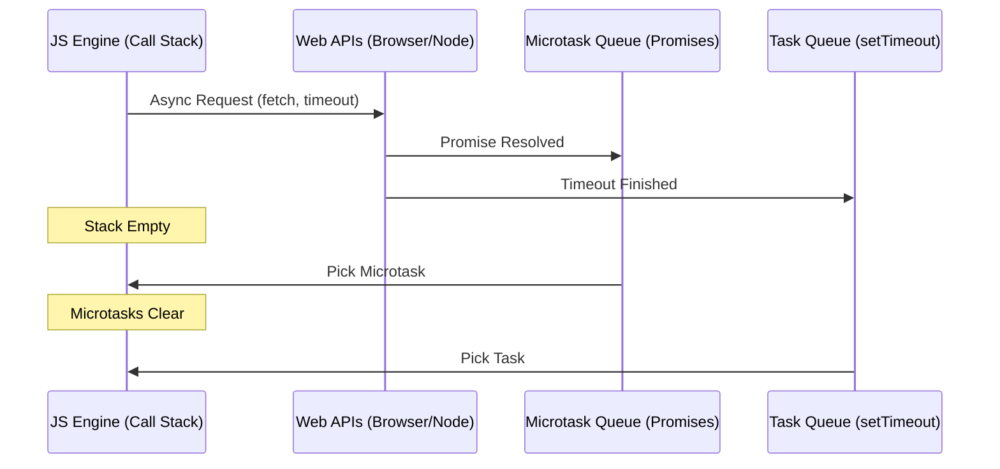

# JavaScript Advanced Q&A

## Visualization: JavaScript Event Loop - **HIGH**

---

## Q1: Explain the Event Loop, Microtasks, and Macrotasks. - **HIGH**
en: The Event Loop coordinates code execution. **Microtasks** (Promises, `queueMicrotask`) have higher priority and are cleared immediately after the current stack is empty. **Macrotasks** (or simply Tasks like `setTimeout`, `setInterval`, `I/O`) are picked only after all pending microtasks are processed.
vi: Event Loop điều phối việc thực thi mã. **Microtasks** (Promises, `queueMicrotask`) có độ ưu tiên cao hơn và được xóa ngay sau khi stack hiện tại trống rỗng. **Macrotasks** (hoặc đơn giản là Tasks như `setTimeout`, `setInterval`, `I/O`) chỉ được chọn sau khi tất cả các microtasks đang chờ xử lý đã được thực hiện xong.

---

## Q2: How does Prototypal Inheritance work in depth? - **HIGH**
en: When accessing a property, if it's not found on the object itself, JS looks at the `__proto__` reference (Prototype) and travels up the chain. Using `Object.create(proto)` allows manual linkage. ES6 Classes are "syntactic sugar" over this mechanism.
vi: Khi truy cập một thuộc tính, nếu không tìm thấy trên chính đối tượng đó, JS sẽ nhìn vào tham chiếu `__proto__` (Prototype) và đi ngược lên chuỗi. Sử dụng `Object.create(proto)` cho phép liên kết thủ công. ES6 Classes chỉ là "lớp vỏ cú pháp" (syntactic sugar) bên trên cơ chế này.

---

## Q3: Deep Dive into `this` - `call`, `apply`, and `bind`. - **HIGH**
en: `this` refers to the object currently executing the function. `call` and `apply` execute the function immediately with a specified `this` context (apply takes an array of args). `bind` returns a new function with a permanently bound `this`.
vi: `this` tham chiếu đến đối tượng hiện đang thực thi hàm. `call` và `apply` thực thi hàm ngay lập tức với một ngữ cảnh `this` được chỉ định (apply nhận một mảng đối số). `bind` trả về một hàm mới với `this` được ràng buộc vĩnh viễn.

---

## Q4: What are JavaScript Proxies and Reflect API? - **HIGH**
en: A **Proxy** object allows you to create a wrapper for another object, intercepting and redefining fundamental operations for that object (like getting/setting properties). **Reflect** is a built-in object that provides methods for interceptable JavaScript operations.
vi: Đối tượng **Proxy** cho phép bạn tạo một lớp bao bọc cho một đối tượng khác, chặn và định nghĩa lại các hoạt động cơ bản của đối tượng đó (như lấy/gán thuộc tính). **Reflect** là một đối tượng tích hợp sẵn cung cấp các phương thức cho các hoạt động JavaScript có thể chặn được.

---

## Q5: Explain Generators and Iterators. - **MEDIUM**
en: An **Iterator** is an object with a `next()` method. A **Generator** (defined with `function*`) is a function that can be paused using `yield` and resumed later, returning a generator object which is also an iterator.
vi: Một **Iterator** là một đối tượng có phương thức `next()`. Một **Generator** (được định nghĩa bằng `function*`) là một hàm có thể bị tạm dừng bằng `yield` và tiếp tục sau đó, trả về một đối tượng generator cũng chính là một iterator.

---

## Q6: What is Memory Management (Garbage Collection) in JS? - **HIGH**
en: JS uses a Mark-and-Sweep algorithm for Garbage Collection. It identifies objects that are no longer "reachable" from the global roots and frees their memory. Memory leaks can still occur due to circular references, accidental global variables, or forgotten timers.
vi: JS sử dụng thuật toán Mark-and-Sweep cho việc thu gom rác (Garbage Collection). Nó xác định các đối tượng không còn "có thể tiếp cận" (reachable) từ các gốc toàn cục và giải phóng bộ nhớ của chúng. Rò rỉ bộ nhớ vẫn có thể xảy ra do các tham chiếu vòng, biến toàn cục vô tình, hoặc các timer bị bỏ quên.

---

## Q7: Functional Programming: Currying and Partial Application. - **MEDIUM**
en: **Currying** is a transformation of a function from `f(a, b, c)` to `f(a)(b)(c)`. **Partial Application** is applying some arguments to a function and returning a new function that takes the remaining arguments.
vi: **Currying** là một sự biến đổi từ hàm `f(a, b, c)` thành `f(a)(b)(c)`. **Partial Application** là việc áp dụng một vài đối số vào một hàm và trả về một hàm mới nhận các đối số còn lại.

---

## Q8: Web Workers and the Multi-threading myth. - **HIGH**
en: JavaScript is single-threaded on its main execution thread. **Web Workers** allow running scripts in background threads, enabling heavy computations without blocking the UI. Communication is handled via message passing (`postMessage`).
vi: JavaScript là đơn luồng trên luồng thực thi chính của nó. **Web Workers** cho phép chạy các script trong các luồng nền, cho phép thực hiện các phép tính nặng mà không làm nghẽn giao diện người dùng (UI). Giao tiếp được xử lý thông qua việc truyền tin nhắn (`postMessage`).

---

## Q9: Module Systems: CommonJS vs ES Modules. - **MEDIUM**
en: **CommonJS** (`require`/`module.exports`) is synchronous and widely used in Node.js. **ES Modules** (`import`/`export`) is the standard for modern JS, supportive of asynchronous loading and static analysis (Tree Shaking).
vi: **CommonJS** (`require`/`module.exports`) là đồng bộ và được sử dụng rộng rãi trong Node.js. **ES Modules** (`import`/`export`) là tiêu chuẩn cho JS hiện đại, hỗ trợ tải bất đồng bộ và phân tích tĩnh (Tree Shaking).

---

## Q10: Tail Call Optimization (TCO). - **MEDIUM**
en: TCO is a feature in some JS engines (primarily WebKit) where a recursive function call at the very end of a function (the tail) does not create a new stack frame, preventing stack overflow errors.
vi: TCO là một tính năng trong một số JS engine (chủ yếu là WebKit) nơi một lệnh gọi hàm đệ quy ở cuối cùng của một hàm (phần đuôi) không tạo ra một stack frame mới, giúp ngăn lỗi tràn ngăn xếp (stack overflow).
