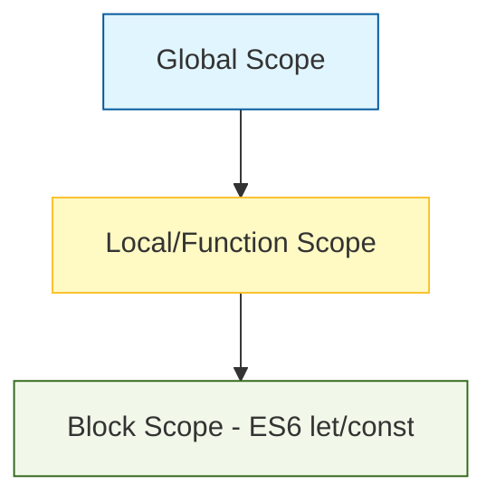

# JavaScript Foundation Q&A

## Visualization: JavaScript Scopes - **HIGH**

---

## Q1: What are the primary data types in JavaScript? - **LOW**
en: JavaScript has two main types: **Primitives** (String, Number, BigInt, Boolean, Undefined, Null, Symbol) and **Objects** (Objects, Arrays, Functions).
vi: JavaScript có hai loại chính: **Cơ bản (Primitives)** (String, Number, BigInt, Boolean, Undefined, Null, Symbol) và **Đối tượng (Objects)** (Objects, Arrays, Functions).

---

## Q2: What is the difference between `var`, `let`, and `const`? - **MEDIUM**
en: `var` is function-scoped and can be hoisted. `let` and `const` are block-scoped. `const` cannot be reassigned after its initial declaration, while `let` can.
vi: `var` có phạm vi trong hàm (function-scoped) và có tính chất hoisting. `let` và `const` có phạm vi trong khối (block-scoped). `const` không thể được gán lại sau khi khai báo lần đầu, trong khi `let` thì có thể.

---

## Q3: What is Hoisting? - **MEDIUM**
en: Hoisting is a behavior where variable and function declarations are moved to the top of their containing scope during the compilation phase. Only the declarations are hoisted, not the initializations.
vi: Hoisting là một hành vi mà các khai báo biến và hàm được đưa lên đầu phạm vi chứa chúng trong giai đoạn biên dịch. Chỉ có các khai báo được kéo lên, không phải các phép gán giá trị.

---

## Q4: Explain Closures in JavaScript. - **HIGH**
en: A closure is the combination of a function bundled together with references to its surrounding state (the lexical environment). It allows a function to access variables from its outer scope even after the outer function has finished executing.
vi: Một closure là sự kết hợp giữa một hàm được bao bọc cùng với các tham chiếu đến trạng thái xung quanh nó (môi trường từ vựng). Nó cho phép một hàm truy cập các biến từ phạm vi bên ngoài ngay cả khi hàm bên ngoài đã thực thi xong.

---

## Q5: What is the difference between `==` and `===`? - **LOW**
en: `==` is the equality operator that performs type coercion (converting operands to a common type before comparing). `===` is the strict equality operator that returns true only if both value and type are the same.
vi: `==` là toán tử bằng thực hiện ép kiểu (chuyển đổi các toán hạng về cùng một kiểu trước khi so sánh). `===` là toán tử bằng nghiêm ngặt, trả về true chỉ khi cả giá trị và kiểu dữ liệu đều giống nhau.

---

## Q6: What is the Prototype chain? - **MEDIUM**
en: Every object in JavaScript has a internal property called `[[Prototype]]`. Objects can inherit properties and methods from their prototype. This chain continues until an object has `null` as its prototype.
vi: Mọi đối tượng trong JavaScript đều có một thuộc tính nội bộ gọi là `[[Prototype]]`. Các đối tượng có thể kế thừa các thuộc tính và phương thức từ prototype của chúng. Chuỗi này tiếp tục cho đến khi một đối tượng có prototype là `null`.

---

## Q7: What are Callbacks? - **LOW**
en: A callback is a function passed as an argument to another function, which is then invoked inside the outer function to complete some kind of routine or action.
vi: Một callback là một hàm được truyền dưới dạng đối số cho một hàm khác, sau đó được gọi bên trong hàm bên ngoài để hoàn thành một loại quy trình hoặc hành động nào đó.

---

## Q8: Explain Promises in JavaScript. - **MEDIUM**
en: A Promise is an object representing the eventual completion (or failure) of an asynchronous operation and its resulting value. It can be in one of three states: pending, fulfilled, or rejected.
vi: Một Promise là một đối tượng đại diện cho sự hoàn thành (hoặc thất bại) cuối cùng của một hoạt động bất đồng bộ và giá trị kết quả của nó. Nó có thể ở một trong ba trạng thái: pending (đang chờ), fulfilled (đã hoàn thành) hoặc rejected (đã bị từ chối).

---

## Q9: What is the Global Execution Context? - **MEDIUM**
en: The Global Execution Context is the default environment where JavaScript code starts executing. It creates the global object (`window` in browsers) and the `this` keyword.
vi: Global Execution Context là môi trường mặc định nơi mã JavaScript bắt đầu thực thi. Nó tạo ra đối tượng toàn cục (`window` trong trình duyệt) và từ khóa `this`.

---

## Q10: What is the purpose of `use strict`? - **LOW**
en: `"use strict"` is a directive that enables strict mode in JavaScript. It helps catch common coding bloopers, prevents the use of certain "unsafe" features, and throws errors for practices that were previously tolerated.
vi: `"use strict"` là một chỉ thị kích hoạt chế độ nghiêm ngặt (strict mode) trong JavaScript. Nó giúp phát hiện các lỗi lập trình phổ biến, ngăn chặn việc sử dụng một số tính năng "không an toàn" và đưa ra lỗi cho các cách làm mà trước đây được chấp nhận.
