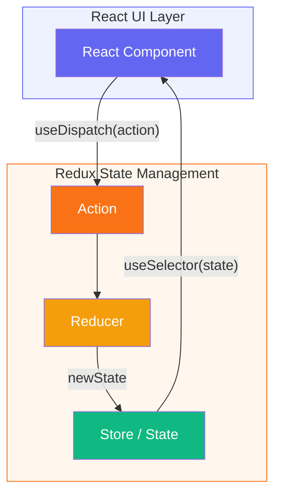

# React Advanced Q&A

## Q1: What is the Context API and when should you use it? **HIGH**
en: The Context API is a way for a React app to effectively produce global variables that can be passed around. This is the alternative to "prop drilling" or moving props from grandparent to child to parent, and so on. Use it when data needs to be accessible by many components at different nesting levels.
vi: Context API là một cách để ứng dụng React tạo ra các biến toàn cục một cách hiệu quả để có thể truyền đi khắp nơi. Đây là giải pháp thay thế cho việc "truyền props tầng tầng lớp lớp" (prop drilling) hoặc di chuyển props từ ông bà sang con cái sang cha mẹ, v.v. Hãy sử dụng nó khi dữ liệu cần được truy cập bởi nhiều thành phần ở các mức lồng nhau khác nhau.

---

## Q2: Explain the useMemo and useCallback hooks. - **HIGH**
en: useMemo returns a memoized value, recomputing it only when dependencies change, useful for expensive calculations. useCallback returns a memoized version of a callback function that only changes if one of the dependencies has changed, useful when passing callbacks to optimized child components that rely on reference equality to prevent unnecessary renders.
vi: useMemo trả về một giá trị đã được ghi nhớ (memoized value), chỉ tính toán lại khi các phụ thuộc thay đổi, hữu ích cho các phép toán tốn kém. useCallback trả về một phiên bản ghi nhớ của một hàm gọi lại (callback function) và chỉ thay đổi nếu một trong các phụ thuộc đã thay đổi, hữu ích khi truyền các callback cho các thành phần con đã được tối ưu hóa dựa trên sự bằng nhau về tham chiếu để ngăn việc vẽ lại không cần thiết.

#### Example / Ví dụ:

**1. useMemo (Result caching / Lưu trữ kết quả):**
```javascript
const expensiveValue = useMemo(() => {
  return items.reduce((acc, curr) => acc + curr, 0) * 1000;
}, [items]);
```

**2. useCallback (Function caching / Lưu trữ hàm):**
```javascript
const handleClick = useCallback(() => {
  console.log("Button clicked");
}, []); // Empty deps = stable reference
```

**Full Illustration / Minh họa đầy đủ:**
```javascript
import React, { useState, useMemo, useCallback } from 'react';

// Optimized child
const Child = React.memo(({ onClick }) => {
  console.log("Child rendered");
  return <button onClick={onClick}>Child Action</button>;
});

function Parent() {
  const [count, setCount] = useState(0);
  const [items] = useState([1, 2, 3]);

  // useMemo: Caches value
  const total = useMemo(() => items.reduce((a, b) => a + b, 0), [items]);

  // useCallback: Caches function reference
  const logTotal = useCallback(() => console.log(total), [total]);

  return (
    <div>
      <p>Count: {count} | Total: {total}</p>
      <button onClick={() => setCount(count + 1)}>Re-render Parent</button>
      <Child onClick={logTotal} />
    </div>
  );
}
```

> **Note / Lưu ý:**
>
> en: 
> - **useMemo** is for caching a **value** to avoid expensive recalculation.
> - **useCallback** is for caching a **function reference** to maintain referential equality.
> - **Misconception**: `useCallback` is not primarily meant to prevent memory leaks (creating functions is cheap). Its main job is to prevent unnecessary re-renders of optimized child components (using `React.memo`) that depend on stable function references.
>
> vi:
> - **useMemo** dùng để ghi nhớ một **giá trị** để tránh việc tính toán lại tốn kém.
> - **useCallback** dùng để ghi nhớ một **tham chiếu hàm** nhằm duy trì tính đồng nhất về tham chiếu.
> - **Hiểu lầm thường gặp**: `useCallback` không phải sinh ra chủ yếu để tránh rò rỉ bộ nhớ (việc tạo hàm rất rẻ). Mục đích chính của nó là ngăn việc render lại không cần thiết của các component con đã được tối ưu hóa (sử dụng `React.memo`) vốn phụ thuộc vào sự ổn định của tham chiếu hàm.

---

## Q3: What are Higher-Order Components (HOC)? - **HIGH**
en: A higher-order component is a function that takes a component and returns a new component. It's a pattern derived from React's compositional nature for reusing component logic.
vi: Một thành phần bậc cao (Higher-Order Component) là một hàm nhận vào một thành phần và trả về một thành phần mới. Đó là một mẫu thiết kế bắt nguồn từ tính chất cấu thành (compositional nature) của React để tái sử dụng logic của thành phần.

#### Example / Ví dụ: `withLogger` HOC

en: An HOC that logs whenever the wrapped component renders.
vi: Một HOC thực hiện việc log (ghi nhật ký) mỗi khi thành phần được bao bọc vẽ lại (render).

```javascript
import React, { useEffect } from 'react';

// en: This is the HOC function
// vi: Đây là hàm HOC
const withLogger = (WrappedComponent) => {
  return (props) => {
    useEffect(() => {
      console.log(`${WrappedComponent.name} rendered with props:`, props);
    });

    // en: Return the original component with additional features/logic
    // vi: Trả về thành phần gốc cùng với các tính năng/logic bổ sung
    return <WrappedComponent {...props} />;
  };
};

// en: Usage in a component
// vi: Cách sử dụng trong một thành phần
const MyButton = ({ label }) => <button>{label}</button>;

// en: Create a new component using the HOC
// vi: Tạo một thành phần mới bằng cách sử dụng HOC
const EnhancedButton = withLogger(MyButton);

// en: Now EnhancedButton will log every time it renders
// vi: Bây giờ EnhancedButton sẽ ghi log mỗi khi nó được render
export default EnhancedButton;
```

> **Note / Lưu ý:**
>
> en: While HOCs are very powerful, modern React often favors **Custom Hooks** for logic reuse as they provide a cleaner, flatter structure without adding extra components to the DOM/Tree.
>
> vi: Mặc dù HOC rất mạnh mẽ, nhưng React hiện đại thường ưu tiên sử dụng **Custom Hooks** để tái sử dụng logic vì chúng cung cấp một cấu trúc sạch sẽ và phẳng hơn mà không cần thêm các thành phần bổ sung vào cây DOM.

---

## Q4: How do Error Boundaries work in React? - **HIGH**
en: Error boundaries are React components that catch JavaScript errors anywhere in their child component tree, log those errors, and display a fallback UI instead of the component tree that crashed. They catch errors during rendering, in lifecycle methods, and in constructors of the whole tree below them.
vi: Biên lỗi (Error boundaries) là các thành phần React giúp bắt các lỗi JavaScript ở bất kỳ đâu trong cây thành phần con của chúng, ghi nhật ký các lỗi đó và hiển thị một giao diện dự phòng thay vì cây thành phần đã bị hỏng. Chúng bắt lỗi trong quá trình vẽ (rendering), trong các phương thức vòng đời và trong các hàm khởi tạo (constructors) của toàn bộ cây bên dưới chúng.

---

## Q5: What is React reconciliation? - **HIGH**
en: Reconciliation is the process through which React updates the DOM. When a component's state or props change, React creates a new virtual DOM tree and compares it with the previous one (diffing). It then calculates the minimum number of changes needed to update the real DOM to match the new virtual DOM.
vi: Đối soát (Reconciliation) là quá trình mà qua đó React cập nhật DOM. Khi trạng thái hoặc props của một thành phần thay đổi, React tạo ra một cây DOM ảo mới và so sánh nó với cây trước đó (diffing). Sau đó, nó tính toán số lượng thay đổi tối thiểu cần thiết để cập nhật DOM thực sao cho khớp với DOM ảo mới.

---

## Q6: What are React Portals? - **LOW**
en: Portals provide a first-class way to render children into a DOM node that exists outside the DOM hierarchy of the parent component. This is commonly used for things like modals, tooltips, and floating menus where you need to break out of the parent's `overflow: hidden` or `z-index` constraints.
vi: Portals cung cấp một cách tối ưu để render các phần tử con vào một nút DOM tồn tại bên ngoài hệ thống phân cấp DOM của thành phần cha. Điều này thường được sử dụng cho những thứ như modal, tooltip và menu thả nổi, nơi bạn cần thoát khỏi các ràng buộc về `overflow: hidden` hoặc `z-index` của thành phần cha.

#### Example / Ví dụ:

**1. HTML structure / Cấu trúc HTML:**
```html
<div id="root"></div>
<!-- en: Target for the portal / vi: Đích đến cho portal -->
<div id="modal-root"></div>
```

**2. Component implementation / Triển khai Component:**
```javascript
import React from 'react';
import ReactDOM from 'react-dom';

const Modal = ({ children, onClose }) => {
  // en: Render children into the 'modal-root' div instead of the parent hierarchy
  // vi: Render các phần tử con vào div 'modal-root' thay vì hệ thống phân cấp của cha
  return ReactDOM.createPortal(
    <div className="modal-overlay" onClick={onClose}>
      <div className="modal-content">
        {children}
        <button onClick={onClose}>Close</button>
      </div>
    </div>,
    document.getElementById('modal-root')
  );
};

function App() {
  const [isOpen, setIsOpen] = React.useState(false);

  return (
    <div className="app-container" style={{ overflow: 'hidden' }}>
      <h1>React Portal Demo</h1>
      <button onClick={() => setIsOpen(true)}>Open Modal</button>

      {isOpen && (
        <Modal onClose={() => setIsOpen(false)}>
          <p>en: This modal is rendered outside the app hierarchy! / vi: Modal này được render bên ngoài phân cấp ứng dụng!</p>
        </Modal>
      )}
    </div>
  );
}
```

---


---

## Q7: What is the purpose of the React Profiler? - **MEDIUM**
en: The Profiler measures how often a React application renders and what the "cost" of rendering is. Its purpose is to help identify parts of an application that are slow
vi: Profiler đo lường tần suất ứng dụng React render và "chi phí" của việc render là bao nhiêu. Mục đích của nó là giúp xác định các phần của ứng dụng bị chậm

---

## Q8: When and why would you create a Custom Hook? - **HIGH**
en: You should create a custom hook when you want to extract component logic into reusable functions. Custom hooks allow you to share logic between multiple components without repeating code, especially when dealing with complex state management or side effects.
vi: Bạn nên tạo một hook tùy chỉnh khi muốn trích xuất logic của thành phần vào các hàm có thể tái sử dụng. Các hook tùy chỉnh cho phép bạn chia sẻ logic giữa nhiều thành phần mà không cần lặp lại mã, đặc biệt là khi xử lý quản lý trạng thái phức tạp hoặc các tác vụ lề (side effects).

#### Example / Ví dụ: `useFetch` Custom Hook

**1. Hook Definition / Định nghĩa Hook:**
```javascript
import { useState, useEffect } from 'react';

function useFetch(url) {
  const [data, setData] = useState(null);
  const [loading, setLoading] = useState(true);
  const [error, setError] = useState(null);

  useEffect(() => {
    const fetchData = async () => {
      try {
        const response = await fetch(url);
        if (!response.ok) throw new Error('Network response was not ok');
        const result = await response.json();
        setData(result);
      } catch (err) {
        setError(err.message);
      } finally {
        setLoading(false);
      }
    };

    fetchData();
  }, [url]);

  return { data, loading, error };
}
```

**2. Component Usage / Sử dụng trong Component:**
```javascript
function UserProfile({ userId }) {
  // en: Using the custom hook / vi: Sử dụng hook tùy chỉnh
  const { data: user, loading, error } = useFetch(`https://api.example.com/users/${userId}`);

  if (loading) return <div>Loading...</div>;
  if (error) return <div>Error: {error}</div>;

  return (
    <div>
      <h1>{user.name}</h1>
      <p>{user.email}</p>
    </div>
  );
}
```

---

## Q9: How do React.lazy and Suspense work together? - **HIGH**
en: `React.lazy` lets you define a component that is loaded dynamically. This helps reduce the initial bundle size. `Suspense` is a component that wraps the lazy component and allows you to show a fallback UI (like a loading spinner) while waiting for the lazy component to load.
vi: `React.lazy` cho phép bạn định nghĩa một thành phần được tải động. Điều này giúp giảm kích thước gói ban đầu. `Suspense` là một thành phần bao bọc thành phần lazy và cho phép bạn hiển thị giao diện dự phòng (như biểu tượng đang tải) trong khi chờ thành phần lazy tải xong.

---

## Q11: How can you optimize a React application? - **HIGH**
en: Optimizing a React app involves several techniques: 1. Use **React.memo** for component memoization. 2. Use **useCallback** and **useMemo** to maintain referential equality. 3. Implement **Code Splitting** using `React.lazy` and `Suspense`. 4. Avoid anonymous functions in props. 5. Use the **Profiler** to identify slow renders. 6. **Windowing/Virtualization** for long lists (e.g., react-window).
vi: Việc tối ưu hóa ứng dụng React bao gồm một số kỹ thuật: 1. Sử dụng **React.memo** để ghi nhớ thành phần. 2. Sử dụng **useCallback** và **useMemo** để duy trì tính đồng nhất về tham chiếu. 3. Triển khai **Code Splitting** (chia tách mã) bằng `React.lazy` và `Suspense`. 4. Tránh sử dụng các hàm ẩn danh trong props. 5. Sử dụng **Profiler** để xác định các lần render chậm. 6. **Windowing/Virtualization** cho các danh sách dài (ví dụ: react-window).

#### Optimization Examples / Ví dụ Tối ưu hóa:

**1. React.memo (Component Memoization / Ghi nhớ Thành phần):**
```javascript
// en: Only re-renders if 'name' prop changes / vi: Chỉ render lại nếu prop 'name' thay đổi
const MyComponent = React.memo(({ name }) => {
  return <div>{name}</div>;
});
```

**2. useCallback & useMemo (Referential Equality / Tính đồng nhất Tham chiếu):**
```javascript
const Parent = () => {
  const [count, setCount] = useState(0);

  // en: Memoized value / vi: Giá trị được ghi nhớ
  const expensiveValue = useMemo(() => computeHeavyValue(count), [count]);

  // en: Memoized function / vi: Hàm được ghi nhớ
  const handleAction = useCallback(() => console.log('Action'), []);

  return <Child value={expensiveValue} onAction={handleAction} />;
};
```

**3. React.lazy & Suspense (Code Splitting / Chia tách mã):**
```javascript
const LazyComponent = React.lazy(() => import('./HeavyComponent'));

function App() {
  return (
    <Suspense fallback={<div>Loading...</div>}>
      <LazyComponent />
    </Suspense>
  );
}
```

**4. Avoid Anonymous Functions (Stable Props / Giữ Props ổn định):**
```javascript
// en: BAD - New function created every render / vi: XẤU - Hàm mới tạo ra mỗi lần render
<button onClick={() => doSomething()}>Click</button>

// en: GOOD - Reference stays stable / vi: TỐT - Tham chiếu giữ nguyên
const handleClick = useCallback(() => doSomething(), []);
<button onClick={handleClick}>Click</button>
```

**5. React Profiler (Identify Bottlenecks / Xác định nút thắt cổ chai):**
```javascript
<Profiler id="App" onRender={(id, phase, actualDuration) => {
  console.log({ id, phase, actualDuration });
}}>
  <MyLargeComponent />
</Profiler>
```

**6. Windowing (Virtualization / Ảo hóa danh sách):**
```javascript
import { FixedSizeList as List } from 'react-window';

// en: Only renders items visible on screen / vi: Chỉ render các mục hiển thị trên màn hình
const MyList = ({ items }) => (
  <List height={500} itemCount={items.length} itemSize={35} width={300}>
    {({ index, style }) => <div style={style}>{items[index]}</div>}
  </List>
);
```

---

## Q12: What is React-Redux? - **HIGH**
en: React-Redux is the official React binding for Redux. It allows your React components to read data from a Redux store, and dispatch actions to the store to update data. It provides a set of hooks (like `useSelector` and `useDispatch`) that make it easy to integrate Redux with React components.
vi: React-Redux là thư viện liên kết chính thức của Redux dành cho React. Nó cho phép các thành phần React của bạn đọc dữ liệu từ store Redux và gửi (dispatch) các hành động (actions) đến store để cập nhật dữ liệu. Nó cung cấp một bộ các hooks (như `useSelector` và `useDispatch`) giúp việc tích hợp Redux vào các thành phần React trở nên dễ dàng.

### React-Redux Data Flow Visualization (Minh họa Luồng dữ liệu)



en: **How it works**: The Component triggers a change using `useDispatch`. The **Action** is sent to the **Reducer**, which calculates the new state. The **Store** updates, and the Component automatically re-renders with the new data via `useSelector`.
vi: **Cách thức hoạt động**: Thành phần (Component) kích hoạt sự thay đổi bằng `useDispatch`. **Action** được gửi đến **Reducer**, nơi tính toán trạng thái mới. **Store** cập nhật, và Thành phần sẽ tự động render lại với dữ liệu mới thông qua `useSelector`.

---


## Q13: What are the benefits of using React-Redux? - **HIGH**
en: Key benefits include: 1. **Predictable State**: Global state management makes it easier to track data changes. 2. **Performance**: It implements performance optimizations internally (like shallow equality checks in `useSelector`). 3. **DevTools**: Integrated with Redux DevTools for time-travel debugging. 4. **Community**: Large ecosystem and battle-tested patterns.
vi: Các lợi ích chính bao gồm: 1. **Trạng thái có thể dự đoán (Predictable State)**: Quản lý trạng thái toàn cục giúp theo dõi các thay đổi dữ liệu dễ dàng hơn. 2. **Hiệu suất (Performance)**: Nó triển khai các tối ưu hóa hiệu suất nội bộ (như kiểm tra shallow equality trong `useSelector`). 3. **DevTools**: Tích hợp với Redux DevTools để gỡ lỗi "du hành thời gian" (time-travel debugging). 4. **Cộng đồng**: Hệ sinh thái lớn và các mẫu thiết kế đã được kiểm chứng thực tế.

---

## Q16: Explain the Provider and Consumer pattern in Context API. - **MEDIUM**
en: The Context API uses two main components: 1. **Provider**: A component that provides the context value to its children, no matter how deep they are. 2. **Consumer**: A component that subscribes to context changes. In modern React, the `useContext` hook is often used instead of the Consumer component for a cleaner syntax.
vi: Context API sử dụng hai thành phần chính: 1. **Provider**: Một thành phần cung cấp giá trị context cho các phần tử con của nó, bất kể chúng sâu đến mức nào. 2. **Consumer**: Một thành phần đăng ký theo dõi các thay đổi của context. Trong React hiện đại, hook `useContext` thường được sử dụng thay thế cho thành phần Consumer để có cú pháp sạch hơn.

---

## Q18: Explain Concurrent Rendering in React. - **HIGH**
en: Concurrent Rendering (introduced in React 18) is a mechanism that allows React to interrupt a long-running render to handle a high-priority event, such as user typing or clicking. Instead of blocking the main thread until a render finishes, React can prepare multiple versions of the UI in the background and switch between them, making the application feel much more responsive.
vi: Kết xuất đồng thời (Concurrent Rendering - được giới thiệu trong React 18) là một cơ chế cho phép React ngắt quãng một quá trình render đang chạy lâu để xử lý một sự kiện có độ ưu tiên cao (chẳng hạn như người dùng đang nhập liệu hoặc nhấp chuột). Thay vì chặn luồng chính (main thread) cho đến khi quá trình render kết thúc, React có thể chuẩn bị nhiều phiên bản của giao diện người dùng trong nền và chuyển đổi giữa chúng, giúp ứng dụng có cảm giác phản hồi nhanh hơn nhiều.

#### Problem Solved: The Blocking UI (Vấn đề được giải quyết: Chặn giao diện)

en: Imagine a search bar that filters a list of 10,000 items. In legacy React, every keystroke triggers a heavy list render that blocks the main thread, making the input feel "stuck" or "laggy".
vi: Hãy tưởng tượng một thanh tìm kiếm lọc danh sách 10.000 mục. Trong React cũ, mỗi lần nhấn phím sẽ kích hoạt một quá trình render danh sách nặng nề làm chặn luồng chính, khiến việc nhập liệu có cảm giác bị "khựng" hoặc "lag".

**Code Example / Ví dụ mã:**

```javascript
import { useState, useTransition } from 'react';

function SearchApp() {
  const [query, setQuery] = useState('');
  const [list, setList] = useState([]);
  const [isPending, startTransition] = useTransition();

  const handleChange = (e) => {
    // en: High Priority: Update the input field immediately
    // vi: Ưu tiên cao: Cập nhật trường nhập liệu ngay lập tức
    setQuery(e.target.value);

    // en: Low Priority (Concurrent): Mark the heavy filtering as a transition
    // vi: Ưu tiên thấp (Đồng thời): Đánh dấu việc lọc danh sách nặng là một transition
    startTransition(() => {
      const filtered = heavyFilter(e.target.value); // en: Expensive task / vi: Tác vụ tốn kém
      setList(filtered);
    });
  };

  return (
    <div>
      <input type="text" value={query} onChange={handleChange} />
      {isPending ? <p>Loading...</p> : <List items={list} />}
    </div>
  );
}
```

en: **Result**: With Concurrent Rendering, React keeps the input responsive. If the user types "ABC" quickly, React interrupts the render for "A" to handle "B", then "C", ensuring the user always sees what they are typing without lag.
vi: **Kết quả**: Với Kết xuất đồng thời, React giữ cho ô nhập liệu luôn phản hồi. Nếu người dùng nhập "ABC" nhanh chóng, React sẽ ngắt quá trình render cho chữ "A" để xử lý chữ "B", sau đó là chữ "C", đảm bảo người dùng luôn thấy những gì họ đang nhập mà không bị lag.

---


## Q19: What is "React Tearing"? - **HIGH**
en: "Tearing" refers to a visual inconsistency where the UI displays different values for the same state at the same time. This is a risk in React 18's Concurrent Mode when using external stores (like Redux or global variables). If a store updates while React is yielding the main thread during a concurrent render, some components might render with the old value and others with the new value. React solved this by introducing the `useSyncExternalStore` hook.
vi: "Tearing" (Xé hình/Bất nhất giao diện) đề cập đến sự không nhất quán về mặt hình ảnh khi giao diện người dùng hiển thị các giá trị khác nhau cho cùng một trạng thái tại cùng một thời điểm. Đây là một rủi ro trong Concurrent Mode của React 18 khi sử dụng các kho lưu trữ bên ngoài (như Redux hoặc biến toàn cục). Nếu một store cập nhật trong khi React đang tạm dừng luồng chính trong quá trình render đồng thời, một số thành phần có thể render với giá trị cũ và một số khác với giá trị mới. React đã giải quyết vấn đề này bằng cách giới thiệu hook `useSyncExternalStore`.

#### Code Example / Ví dụ mã:

**1. The Problem: Tearing with an external store / Vấn đề: Tearing với store bên ngoài**

```javascript
// en: Global variable outside React's control / vi: Biến toàn cục nằm ngoài sự kiểm soát của React
let externalStore = { value: 0 };
const listeners = new Set();

// en: Components reading directly from externalStore during Concurrent Rendering
// vi: Các components đọc trực tiếp từ externalStore trong khi Render đồng thời
function Component() {
  // en: RISK: If externalStore.value changes between component renders, 
  // they might show different values (Tearing).
  // vi: RỦI RO: Nếu externalStore.value thay đổi giữa các lần render của component,
  // chúng có thể hiển thị các giá trị khác nhau (Tearing).
  const value = externalStore.value;
  return <div>Value: {value}</div>;
}
```

**2. The Solution: `useSyncExternalStore` / Giải pháp: `useSyncExternalStore`**

```javascript
import { useSyncExternalStore } from 'react';

// en: Modern way to safely subscribe to external stores
// vi: Cách hiện đại để đăng ký theo dõi các store bên ngoài một cách an toàn
function SafeComponent() {
  const value = useSyncExternalStore(
    (callback) => {
      listeners.add(callback);
      return () => listeners.delete(callback);
    },
    () => externalStore.value // en: Returns current value / vi: Trả về giá trị hiện tại
  );

  return <div>Safe Value: {value}</div>;
}
```

en: **Explanation**: `useSyncExternalStore` ensures that even if an update happens in the middle of a concurrent render, React will detect the inconsistency and "re-tilt" the render to ensure the UI stays synchronized (no tearing).

vi: **Giải thích**: `useSyncExternalStore` đảm bảo rằng ngay cả khi có một bản cập nhật xảy ra giữa quá trình render đồng thời, React sẽ phát hiện ra sự không nhất quán và thực hiện render lại để đảm bảo giao diện được đồng bộ hóa (không bị xé hình).

---
