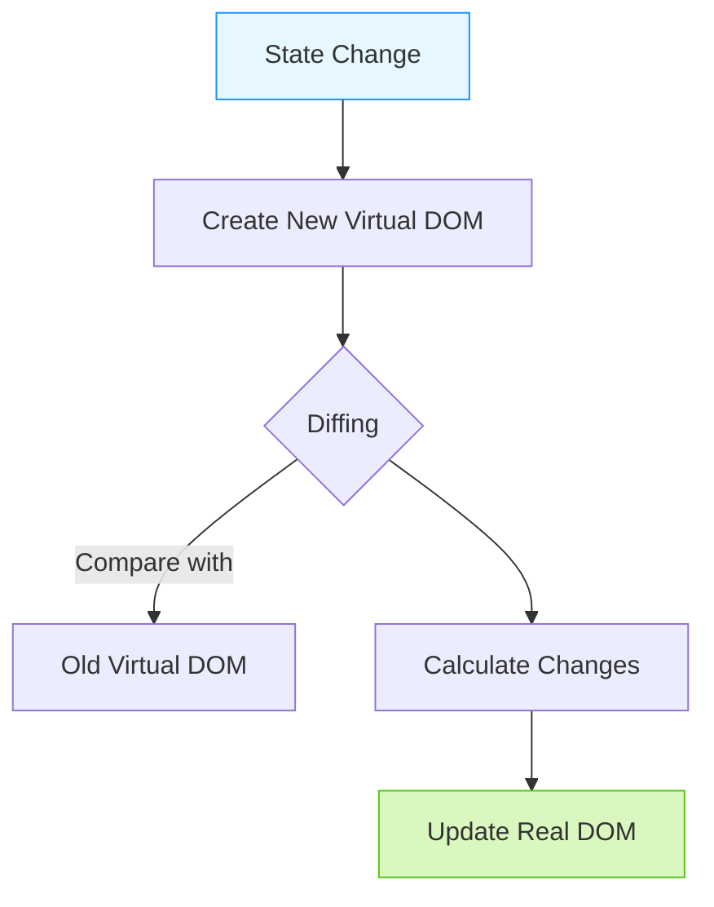
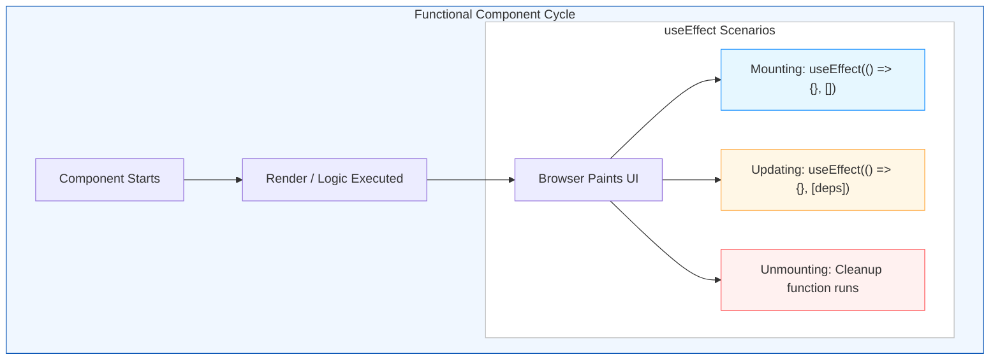

# React Foundation Q&A

## Q1: What is JSX? - **LOW**
en: JSX stands for JavaScript XML. It is a syntax extension for JavaScript that allows you to write HTML-like code within your JavaScript files. It makes it easier to describe what the UI should look like.
vi: JSX (JavaScript XML) là một phần mở rộng cú pháp cho JavaScript, cho phép bạn viết mã giống như HTML ngay trong các tệp JavaScript. Nó giúp việc mô tả giao diện người dùng (UI) trở nên dễ dàng hơn.

---

## Q6: What is the Virtual DOM and how does it work? - **HIGH**
en: The Virtual DOM is a lightweight, in-memory representation of the real DOM. When the state of an object changes, React updates the virtual DOM first. Then, it compares the current virtual DOM with a previous version (diffing) and only updates the necessary parts in the real DOM.
vi: Virtual DOM là một đại diện nhẹ, nằm trong bộ nhớ của Real DOM. Khi trạng thái của một đối tượng thay đổi, React sẽ cập nhật Virtual DOM trước. Sau đó, nó so sánh Virtual DOM hiện tại với phiên bản trước đó (diffing) và chỉ cập nhật những phần cần thiết trong Real DOM.

### Visualization (Minh họa)



---

## Q3: What are Props and State? - **LOW**
en: Props (short for "properties") are read-only inputs passed from a parent component to a child component. State is a local data storage that is managed within the component itself and can change over time, triggering a re-render.
vi: Props (viết tắt của "properties") là các đầu vào chỉ đọc được truyền từ thành phần cha sang thành phần con. Trạng thái (State) là kho lưu trữ dữ liệu cục bộ được quản lý bên trong chính thành phần đó và có thể thay đổi theo thời gian, kích hoạt việc vẽ lại (re-render).

---

## Q4: How do you handle events in React? - **LOW**
en: Handling events in React is similar to handling events on DOM elements, but with some syntax differences: Events are named using camelCase (e.g., onClick instead of onclick) and you pass a function as the event handler rather than a string.
vi: Việc xử lý sự kiện trong React tương tự như xử lý sự kiện trên các phần tử DOM, nhưng có một số khác biệt về cú pháp: Các sự kiện được đặt tên theo kiểu camelCase (ví dụ: onClick thay vì onclick) và bạn truyền một hàm làm trình xử lý sự kiện thay vì một chuỗi.

---

## Q5: Why is the 'key' prop important in lists? - **MEDIUM**
en: Keys help React identify which items have changed, been added, or been removed. They should be given to the elements inside the array to give the elements a stable identity, which helps in efficient DOM updates during reconciliation.
vi: Các khóa (Keys) giúp React xác định mục nào đã thay đổi, được thêm vào hoặc bị xóa bỏ. Chúng nên được gán cho các phần tử bên trong mảng để tạo cho chúng một danh tính ổn định, giúp cập nhật DOM hiệu quả trong quá trình đối soát (reconciliation).

---

## Q7: What is the useEffect hook used for? - **HIGH**
en: The useEffect hook allows you to perform side effects in functional components. Examples of side effects include fetching data, directly updating the DOM, and setting up subscriptions. It serves a similar purpose as componentDidMount, componentDidUpdate, and componentWillUnmount in React classes.
vi: Hook useEffect cho phép bạn thực hiện các tác vụ lề (side effects) trong các thành phần hàm. Ví dụ về các tác vụ lề bao gồm lấy dữ liệu, cập nhật DOM trực tiếp và thiết lập các đăng ký (subscriptions). Nó phục vụ mục đích tương tự như componentDidMount, componentDidUpdate và componentWillUnmount trong các lớp (classes) React.

---

## Q8: How does conditional rendering work in React? - **HIGH**
en: Conditional rendering in React works just like conditional logic in JavaScript. Since React components are essentially functions, you can use standard operators like if, &&, and ternary operators to decide which UI elements should actually hit the screen.
vi: Render có điều kiện trong React hoạt động tương tự như logic điều kiện trong JavaScript. Vì các component trong React thực chất là các hàm, bạn có thể sử dụng các toán tử tiêu chuẩn như `if`, `&&`, và toán tử ba ngôi (ternary) để quyết định phần tử UI nào sẽ thực sự được hiển thị lên màn hình.

---

## Q9: What are React Fragments? - **LOW**
en: Fragments let you group a list of children without adding extra nodes to the DOM. You can use `<React.Fragment>` or the short syntax `<>...</>`.
vi: Fragments cho phép bạn nhóm một danh sách các phần tử con mà không cần thêm các nút bổ sung vào DOM. Bạn có thể sử dụng `<React.Fragment>` hoặc cú pháp ngắn gọn `<>...</>`.

---

## Q10: What is the difference between Controlled and Uncontrolled components? - **LOW**
en: In a controlled component, form data is handled by a React component state. In uncontrolled components, form data is handled by the DOM itself, often using refs to pull values from the form.
vi: Trong một thành phần được kiểm soát (controlled component), dữ liệu form được xử lý bởi trạng thái (state) của thành phần React. Trong các thành phần không được kiểm soát (uncontrolled components), dữ liệu form được xử lý bởi chính DOM, thường sử dụng refs để lấy các giá trị từ form.

---

## React Component Lifecycle (Hooks) Visualization - **HIGH**




---

## Q10: What are the three main phases of a React component's lifecycle? - **HIGH**
en: The three main phases are: 1. **Mounting** (putting elements into the DOM), 2. **Updating** (when a component's state or props change), and 3. **Unmounting** (removing elements from the DOM).
vi: Ba giai đoạn chính là: 1. **Mounting** (đưa các phần tử vào DOM), 2. **Updating** (khi trạng thái hoặc props của thành phần thay đổi), và 3. **Unmounting** (loại bỏ các phần tử khỏi DOM).

---

## Q11: How do you perform cleanup in a functional component? - **MEDIUM**
en: In functional components, you perform cleanup (like clearing timers or cancelling network requests) by returning a function from the `useEffect` hook. This function runs before the component unmounts and before the effect re-runs.
vi: Trong các thành phần hàm (functional components), bạn thực hiện dọn dẹp (như xóa bộ hẹn giờ hoặc hủy yêu cầu mạng) bằng cách trả về một hàm từ hook `useEffect`. Hàm này chạy trước khi thành phần bị hủy (unmount) và trước khi hiệu ứng chạy lại.

#### Example / Ví dụ: `Window Resize Listener`

en: We add an event listener when the component mounts and MUST remove it during cleanup to prevent memory leaks and unexpected behavior.
vi: Chúng ta thêm một trình lắng nghe sự kiện khi thành phần được gắn (mount) và BẮT BUỘC phải gỡ bỏ nó trong quá trình dọn dẹp để tránh rò rỉ bộ nhớ và các hành vi không mong muốn.

```javascript
import { useState, useEffect } from 'react';

function WindowWidth() {
  const [width, setWidth] = useState(window.innerWidth);

  useEffect(() => {
    const handleResize = () => setWidth(window.innerWidth);

    // en: Setup: Add the listener / vi: Thiết lập: Thêm trình lắng nghe
    window.addEventListener('resize', handleResize);

    // en: Cleanup: Return a function to remove the listener
    // vi: Dọn dẹp: Trả về một hàm để gỡ bỏ trình lắng nghe
    return () => {
      console.log('Cleaning up resize listener...');
      window.removeEventListener('resize', handleResize);
    };
  }, []); // en: Run once on mount / vi: Chạy một lần khi mount

  return <div>Window width: {width}px</div>;
}
```

---

## Q12: How can you prevent a functional component from re-rendering unnecessarily? - **MEDIUM**
en: You can use `React.memo` to prevent unnecessary re-renders. It is a higher-order component that wraps your functional component, memoizing the result and only re-rendering if the props have changed (via shallow comparison).
vi: Bạn có thể sử dụng `React.memo` để ngăn việc render lại không cần thiết. Đây là một higher-order component bao bọc thành phần hàm của bạn, giúp ghi nhớ kết quả và chỉ render lại nếu các props thay đổi (thông qua so sánh nông).

---

## Q14: What is MVC architecture and how does React fit in? - **LOW**
en: MVC stands for Model-View-Controller. It's a design pattern for developing user interfaces. React is often considered only the 'V' (View) in MVC because it is responsible only for rendering the UI. It doesn't dictate how you handle the Controller or Model logic.
vi: MVC là viết tắt của Model-View-Controller. Đó là một mẫu thiết kế để phát triển giao diện người dùng. React thường được coi chỉ là phần 'V' (View) trong MVC vì nó chỉ chịu trách nhiệm hiển thị giao diện người dùng. Nó không quy định cách bạn xử lý logic Controller hoặc Model.

---

## Q15: What are the basic building blocks of React? - **LOW**
en: The basic building blocks of React are **Components**, **JSX**, **Props**, and **State**. Components are self-contained modules that render UI, JSX is the syntax used to describe UI, Props are inputs, and State is internal data.
vi: Các thành phần cơ bản của React là **Components**, **JSX**, **Props**, và **State**. Các thành phần (Components) là các mô-đun độc lập hiển thị giao diện người dùng, JSX là cú pháp, Props là đầu vào, và State là dữ liệu nội bộ.

---

## Q16: What is a Component and what are its types? - **LOW**
en: A Component is a reusable piece of code that returns a React element. Main types: **Functional Components** (functions with Hooks) and **Class Components** (ES6 classes). Modern development favors functional components.
vi: Một thành phần (Component) là một đoạn mã có thể tái sử dụng trả về một phần tử React. Có hai loại chính: **Thành phần hàm** (hàm kèm Hooks) và **Thành phần lớp** (lớp ES6). Phát triển hiện đại ưu tiên các thành phần hàm.

---

## Q17: How does the browser read JSX? - **MEDIUM**
en: Browsers cannot read JSX directly because it's not valid JavaScript. JSX must be "transpiled" into regular JavaScript (usually using a tool like Babel) before it reaches the browser. For example, `<h1>Hello</h1>` is converted to `React.createElement('h1', null, 'Hello')`.
vi: Trình duyệt không thể đọc trực tiếp JSX vì nó không phải là JavaScript hợp lệ. JSX phải được "biên dịch chuyển đổi" (transpiled) thành JavaScript thông thường (thường sử dụng một công cụ như Babel) trước khi đến trình duyệt. Ví dụ: `<h1>Hello</h1>` được chuyển đổi thành `React.createElement('h1', null, 'Hello')`.

---

## Q18: What is the difference between Functional and Class components? - **HIGH**
en: Functional components are simple JavaScript functions that take props and return JSX. They are easier to read and test. Class components are ES6 classes that can hold state and use lifecycle methods. Since React 16.8 (Hooks), functional components can do almost everything class components can.
vi: Các thành phần hàm (Functional components) là các hàm JavaScript đơn giản nhận props và trả về JSX. Chúng dễ đọc và kiểm tra hơn. Các thành phần lớp (Class components) là các lớp ES6 có thể giữ trạng thái và sử dụng các phương thức vòng đời. Kể từ React 16.8 (Hooks), các thành phần hàm có thể làm hầu hết mọi thứ mà các thành phần lớp có thể làm.

---

## Q19: What is One-Way Data Binding in React? - **HIGH**
en: React uses one-way data flow, meaning data stays in the parent and is passed down to children via props. This makes the code more predictable and maintains a clear "Single Source of Truth."
vi: React sử dụng luồng dữ liệu một chiều, nghĩa là dữ liệu nằm ở cha và được truyền xuống con thông qua props. Điều này giúp mã dễ dự đoán hơn và duy trì một "Nguồn sự thật duy nhất" rõ ràng.

> **Note on "Single Source of Truth"**:
> en: This means data is stored in one place only (a component’s state). If other components need it, they receive it as props. This prevents "out-of-sync" bugs where different parts of the UI show different values for the same piece of data.
> vi: Điều này có nghĩa là dữ liệu chỉ được lưu trữ ở một nơi duy nhất (state của một component). Nếu các component khác cần nó, chúng sẽ nhận được nó dưới dạng props. Điều này ngăn chặn các lỗi "mất đồng bộ" khi các phần khác nhau của giao diện hiển thị các giá trị khác nhau cho cùng một mẩu dữ liệu.

#### Example / Ví dụ:

```javascript
function Parent() {
  const [message] = useState("Hello from Parent");
  // en: Data flows DOWN to Child / vi: Dữ liệu truyền XUỐNG cho con
  return <Child text={message} />;
}

function Child({ text }) {
  return <p>{text}</p>;
}
```

---

## Q20: Does React support Two-Way Data Binding? - **HIGH**
en: React does not have built-in two-way data binding (like Angular). However, you can achieve it using **Controlled Components**. This is done by linking an input's `value` to a state variable and updating that state via an `onChange` event handler.
vi: React không có ràng buộc dữ liệu hai chiều (two-way data binding) tích hợp sẵn (như Angular). Tuy nhiên, bạn có thể đạt được nó bằng cách sử dụng **Thành phần được kiểm soát (Controlled Components)**. Điều này được thực hiện bằng cách liên kết `value` của một ô nhập liệu với một biến trạng thái (state) và cập nhật trạng thái đó thông qua trình xử lý sự kiện `onChange`.

#### Example / Ví dụ:
```javascript
function ControlledInput() {
  const [name, setName] = useState("");

  return (
    <input 
      value={name} // en: View reflects State / vi: Giao diện phản ánh State
      onChange={(e) => setName(e.target.value)} // en: Input updates State / vi: Nhập liệu cập nhật State
    />
  );
}
```


---

## Q21: What are Refs in React and what are they used for? - **MEDIUM**
en: Refs (References) provide a way to access DOM nodes or React elements directly. They are created using the `useRef` hook in functional components.
vi: Refs (Tham chiếu) cung cấp cách truy cập trực tiếp các nút DOM hoặc phần tử React. Chúng được tạo bằng hook `useRef` trong các thành phần hàm.

> **Note on Persistent & Mutable Nature / Ghi chú về tính Bền vững & Khả biến:**
> en: A `ref` is an object that **persists for the entire lifetime** of the component. Unlike normal variables, React guarantees it won't be re-created on every render. Crucially, updating `ref.current` **does not** trigger a re-render, making it perfect for storing data that doesn't affect the UI directly (like timer IDs).
> vi: Một `ref` là một đối tượng **tồn tại xuyên suốt toàn bộ vòng đời** của component. Không giống như các biến thông thường, React đảm bảo nó sẽ không bị tạo lại mỗi khi render. Quan trọng là, việc cập nhật `ref.current` **không** kích hoạt render lại, giúp nó trở nên hoàn hảo để lưu trữ dữ liệu không trực tiếp ảnh hưởng đến giao diện (như ID của bộ hẹn giờ).

#### Example / Ví dụ: Using Ref for a Timer (Mutable State)
```javascript
import { useRef, useState } from 'react';

function Timer() {
  const [count, setCount] = useState(0);
  const timerRef = useRef(null); // en: Persists through renders / vi: Lưu trữ bền vững qua các lần render

  const startTimer = () => {
    // en: Update ref.current directly without re-rendering
    // vi: Cập nhật trực tiếp ref.current mà không gây render lại
    timerRef.current = setInterval(() => {
      setCount(prev => prev + 1);
    }, 1000);
  };

  const stopTimer = () => {
    // en: Read the ID back from ref.current to clear
    // vi: Đọc lại ID từ ref.current để dừng
    clearInterval(timerRef.current);
  };

  return (
    <div>
      <p>Count: {count}</p>
      <button onClick={startTimer}>Start</button>
      <button onClick={stopTimer}>Stop</button>
    </div>
  );
}
```

---

## Q22: What are React Hooks? - **LOW**
en: Hooks are functions that let you “hook into” React state and lifecycle features from functional components. Examples include `useState`, `useEffect`, and `useContext`.
vi: Hooks là các hàm cho phép bạn "móc vào" trạng thái và tính năng vòng đời của React từ các thành phần hàm. Ví dụ bao gồm `useState`, `useEffect` và `useContext`.

---

## Q23: Explain the useState Hook. - **LOW**
en: `useState` allows you to add state to functional components. It returns the current state value and a function to update it.
vi: `useState` cho phép bạn thêm trạng thái vào các thành phần hàm. Nó trả về giá trị trạng thái hiện tại và một hàm để cập nhật nó.

---

## Q24: What are React Developer Tools? - **LOW**
en: A browser extension for inspecting the React component hierarchy, viewing props/state, and debugging performance with the Profiler.
vi: Một tiện ích mở rộng trình duyệt để kiểm tra hệ thống thành phần React, xem props/state và gỡ lỗi hiệu suất với Profiler.

---