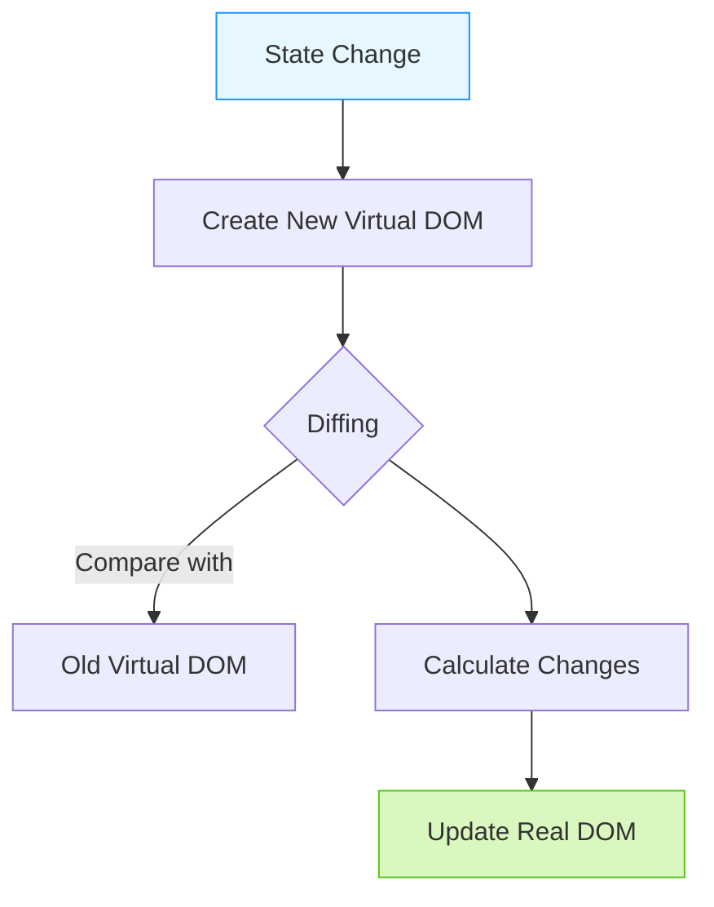

# React Foundation Q&A

## Q1: What is JSX? - **LOW**
en: JSX stands for JavaScript XML. It is a syntax extension for JavaScript that allows you to write HTML-like code within your JavaScript files. It makes it easier to describe what the UI should look like.
vi: JSX (JavaScript XML) là một phần mở rộng cú pháp cho JavaScript, cho phép bạn viết mã giống như HTML ngay trong các tệp JavaScript. Nó giúp việc mô tả giao diện người dùng (UI) trở nên dễ dàng hơn.

---

## Q6: What is the Virtual DOM and how does it work? - **HIGH**
en: The Virtual DOM is a lightweight, in-memory representation of the real DOM. When the state of an object changes, React updates the virtual DOM first. Then, it compares the current virtual DOM with a previous version (diffing) and only updates the necessary parts in the real DOM.
vi: Virtual DOM là một đại diện nhẹ, nằm trong bộ nhớ của Real DOM. Khi trạng thái của một đối tượng thay đổi, React sẽ cập nhật Virtual DOM trước. Sau đó, nó so sánh Virtual DOM hiện tại với phiên bản trước đó (diffing) và chỉ cập nhật những phần cần thiết trong Real DOM.

### Visualization (Minh họa)

---

## Q3: What are Props and State? - **LOW**
en: Props (short for "properties") are read-only inputs passed from a parent component to a child component. State is a local data storage that is managed within the component itself and can change over time, triggering a re-render.
vi: Props (viết tắt của "properties") là các đầu vào chỉ đọc được truyền từ thành phần cha sang thành phần con. Trạng thái (State) là kho lưu trữ dữ liệu cục bộ được quản lý bên trong chính thành phần đó và có thể thay đổi theo thời gian, kích hoạt việc vẽ lại (re-render).

---

## Q4: How do you handle events in React? - **LOW**
en: Handling events in React is similar to handling events on DOM elements, but with some syntax differences: Events are named using camelCase (e.g., onClick instead of onclick) and you pass a function as the event handler rather than a string.
vi: Việc xử lý sự kiện trong React tương tự như xử lý sự kiện trên các phần tử DOM, nhưng có một số khác biệt về cú pháp: Các sự kiện được đặt tên theo kiểu camelCase (ví dụ: onClick thay vì onclick) và bạn truyền một hàm làm trình xử lý sự kiện thay vì một chuỗi.

---

## Q5: Why is the 'key' prop important in lists?
en: Keys help React identify which items have changed, been added, or been removed. They should be given to the elements inside the array to give the elements a stable identity, which helps in efficient DOM updates during reconciliation.
vi: Các khóa (Keys) giúp React xác định mục nào đã thay đổi, được thêm vào hoặc bị xóa bỏ. Chúng nên được gán cho các phần tử bên trong mảng để tạo cho chúng một danh tính ổn định, giúp cập nhật DOM hiệu quả trong quá trình đối soát (reconciliation).

---

## Q7: What is the useEffect hook used for?
en: The useEffect hook allows you to perform side effects in functional components. Examples of side effects include fetching data, directly updating the DOM, and setting up subscriptions. It serves a similar purpose as componentDidMount, componentDidUpdate, and componentWillUnmount in React classes.
vi: Hook useEffect cho phép bạn thực hiện các tác vụ lề (side effects) trong các thành phần hàm. Ví dụ về các tác vụ lề bao gồm lấy dữ liệu, cập nhật DOM trực tiếp và thiết lập các đăng ký (subscriptions). Nó phục vụ mục đích tương tự như componentDidMount, componentDidUpdate và componentWillUnmount trong các lớp (classes) React.

---

## Q8: How does conditional rendering work in React?
en: Conditional rendering in React works the same way conditions work in JavaScript. Use JavaScript operators like 'if' or the ternary operator to create elements representing the current state, and let React update the UI to match them.
vi: Việc render có điều kiện trong React hoạt động giống như cách các điều kiện hoạt động trong JavaScript. Sử dụng các toán tử JavaScript như 'if' hoặc toán tử ba ngôi để tạo các phần tử đại diện cho trạng thái hiện tại, và để React cập nhật giao diện người dùng cho phù hợp.

---

## Q9: What are React Fragments?
en: Fragments let you group a list of children without adding extra nodes to the DOM. You can use `<React.Fragment>` or the short syntax `<>...</>`.
vi: Fragments cho phép bạn nhóm một danh sách các phần tử con mà không cần thêm các nút bổ sung vào DOM. Bạn có thể sử dụng `<React.Fragment>` hoặc cú pháp ngắn gọn `<>...</>`.

---

## Q10: What is the difference between Controlled and Uncontrolled components?
en: In a controlled component, form data is handled by a React component state. In uncontrolled components, form data is handled by the DOM itself, often using refs to pull values from the form.
vi: Trong một thành phần được kiểm soát (controlled component), dữ liệu form được xử lý bởi trạng thái (state) của thành phần React. Trong các thành phần không được kiểm soát (uncontrolled components), dữ liệu form được xử lý bởi chính DOM, thường sử dụng refs để lấy các giá trị từ form.
