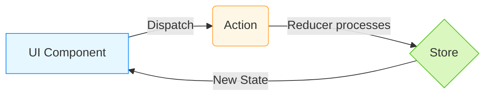

# Redux Foundation Q&A

## Redux Data Flow Visualization - **HIGH**

---

## Q1: What is Redux? - **LOW**
en: Redux is a predictable state container for JavaScript apps. It helps you write applications that behave consistently, run in different environments (client, server, and native), and are easy to test.
vi: Redux là một kho chứa trạng thái có thể dự đoán được cho các ứng dụng JavaScript. Nó giúp bạn viết các ứng dụng hoạt động nhất quán, chạy trong các môi trường khác nhau (client, server và native) và dễ dàng kiểm tra.

---

## Q2: What are the three principles of Redux? - **MEDIUM**
en: 1. **Single source of truth**: The global state of your application is stored in an object tree within a single store. 2. **State is read-only**: The only way to change the state is to emit an action. 3. **Changes are made with pure functions**: To specify how the state tree is transformed by actions, you write pure reducers.
vi: 1. **Nguồn sự thật duy nhất (Single source of truth)**: Trạng thái toàn cục của ứng dụng được lưu trữ trong một cây đối tượng bên trong một store duy nhất. 2. **Trạng thái là chỉ đọc (State is read-only)**: Cách duy nhất để thay đổi trạng thái là phát ra một action. 3. **Thay đổi được thực hiện bằng các hàm thuần túy (Changes are made with pure functions)**: Để chỉ định cách cây trạng thái được biến đổi bởi các actions, bạn viết các reducers thuần túy.

---

## Q3: What is a Store in Redux? - **LOW**
en: The Store is the object that brings actions and reducers together. It holds the application state, allows access to state via `getState()`, allows state to be updated via `dispatch(action)`, and registers listeners via `subscribe(listener)`.
vi: Store là đối tượng kết hợp các actions và reducers lại với nhau. Nó giữ trạng thái ứng dụng, cho phép truy cập trạng thái thông qua `getState()`, cho phép cập nhật trạng thái thông qua `dispatch(action)` và đăng ký các listener thông qua `subscribe(listener)`.

---

## Q4: What is an Action? - **LOW**
en: Actions are plain JavaScript objects that have a `type` field. You can think of an action as an event that describes something that happened in the application.
vi: Actions là các đối tượng JavaScript đơn thuần có trường `type`. Bạn có thể coi một action như một sự kiện mô tả điều gì đó đã xảy ra trong ứng dụng.

---

## Q5: What is a Reducer? - **LOW**
en: A reducer is a function that receives the current `state` and an `action` object, decides how to update the state if necessary, and returns the new state: `(state, action) => newState`.
vi: Reducer là một hàm nhận vào `state` hiện tại và một đối tượng `action`, quyết định cách cập nhật trạng thái nếu cần thiết và trả về trạng thái mới: `(state, action) => newState`.

---

## Q6: What is the role of Dispatch? - **LOW**
en: `dispatch` is a store method. It is the only way to trigger a state change. You call `store.dispatch(action)` to notify the store that an event occurred.
vi: `dispatch` là một phương thức của store. Đây là cách duy nhất để kích hoạt thay đổi trạng thái. Bạn gọi `store.dispatch(action)` để thông báo cho store rằng một sự kiện đã xảy ra.

---

## Q7: What is the difference between Redux and React Context API? - **MEDIUM**
en: React Context is a dependency injection tool for passing data through the component tree without prop drilling. Redux is a full state management library with a centralized store, middleware support, and powerful debugging tools (DevTools). Redux is better for complex state and high-frequency updates.
vi: React Context là một công cụ tiêm phụ thuộc (dependency injection) để truyền dữ liệu qua cây thành phần mà không cần prop drilling. Redux là một thư viện quản lý trạng thái đầy đủ với store tập trung, hỗ trợ middleware và các công cụ gỡ lỗi mạnh mẽ (DevTools). Redux tốt hơn cho các trạng thái phức tạp và các cập nhật tần suất cao.

---

## Q8: Why are Reducers required to be pure functions? - **MEDIUM**
en: Reducers must be pure to ensure predictability and enable features like time-travel debugging and hot reloading. A pure function always returns the same output for the same input and has no side effects, making it easy to track state changes.
vi: Các Reducers phải là hàm thuần túy để đảm bảo tính dự đoán và cho phép các tính năng như gỡ lỗi du hành thời gian (time-travel debugging) và hot reloading. Một hàm thuần túy luôn trả về cùng một đầu ra cho cùng một đầu vào và không có tác dụng phụ (side effects), giúp việc theo dõi các thay đổi trạng thái trở nên dễ dàng.

---

## Q9: What is "Single Source of Truth"? - **LOW**
en: This principle states that the entire state of an application is stored in a single object tree within a single store. This makes it easier to debug, persist state, and synchronize the UI with the data.
vi: Nguyên tắc này quy định rằng toàn bộ trạng thái của một ứng dụng được lưu trữ trong một cây đối tượng duy nhất bên trong một store duy nhất. Điều này giúp dễ dàng gỡ lỗi, lưu trữ trạng thái và đồng bộ hóa giao diện người dùng với dữ liệu.

---

## Q10: What is a Redux Slice? - **LOW**
en: A "slice" is a collection of Redux reducer logic and actions for a single feature in your app, typically defined together in a single file using Redux Toolkit's `createSlice` function.
vi: Một "slice" là một tập hợp các logic reducer và actions cho một tính năng đơn lẻ trong ứng dụng của bạn, thường được định nghĩa cùng nhau trong một tệp duy nhất bằng cách sử dụng hàm `createSlice` của Redux Toolkit.
