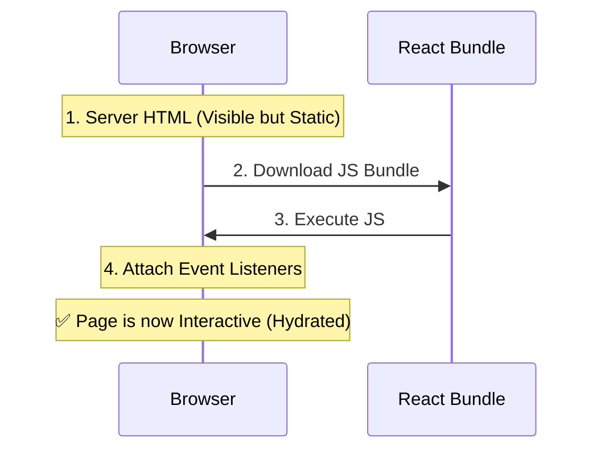

# Web Performance Advanced Q&A

## Q1: How can you optimize LCP (Largest Contentful Paint)?
en: To optimize LCP, you should: (1) Ensure the LCP resource (like the hero image) is discoverable early in the HTML document, often using `<link rel="preload">` or ``. (2) Optimize image formats (WebP/AVIF) and size. (3) Serve static assets via a CDN. (4) Reduce server response times (TTFB).
vi: Để tối ưu hóa LCP, bạn nên: (1) Đảm bảo tài nguyên LCP (như hình ảnh hero) có thể được khám phá sớm trong tài liệu HTML, thường sử dụng `<link rel="preload">` hoặc ``. (2) Tối ưu hóa định dạng (WebP/AVIF) và kích thước hình ảnh. (3) Phục vụ các tài sản tĩnh qua CDN. (4) Giảm thời gian phản hồi máy chủ (TTFB).

---

## Q2: How do you reduce TTI (Time to Interactive) and Total Blocking Time (TBT)?
en: Reducing TTI and TBT involves minimizing long tasks (tasks > 50ms) on the main thread. Strategies include: (1) Code splitting and lazy loading JavaScript. (2) Deferring non-critical scripts. (3) Using Web Workers to move heavy computations off the main thread. (4) Removing unused code (Tree Shaking).
vi: Việc giảm TTI và TBT liên quan đến việc giảm thiểu các tác vụ dài (tác vụ > 50 mili giây) trên luồng chính. Các chiến lược bao gồm: (1) Tách mã (Code splitting) và tải chậm (lazy loading) JavaScript. (2) Trì hoãn các tập lệnh không quan trọng. (3) Sử dụng Web Workers để chuyển các tính toán nặng ra khỏi luồng chính. (4) Loại bỏ mã không sử dụng (Tree Shaking).

---

## Q3: What is INP (Interaction to Next Paint) and how is it different from FID?
en: INP is a metric that assesses a page's overall responsiveness to user interactions by observing the latency of all click, tap, and keyboard interactions. Unlike FID (First Input Delay), which only measures the delay of the *first* interaction, INP is a more holistic metric.
vi: INP (Tương tác đến lần hiển thị tiếp theo) là chỉ số đánh giá khả năng phản hồi chung của trang đối với các tương tác của người dùng bằng cách quan sát độ trễ của tất cả các tương tác nhấp, chạm và bàn phím. Khác với FID (Độ trễ đầu vào đầu tiên) chỉ đo độ trễ của tương tác *đầu tiên*, INP là một chỉ số toàn diện hơn.

---

## Q4: Explain the difference between 'async' and 'defer' attributes on script tags.
en: Both load the script without blocking HTML parsing. `async` executes the script as soon as it's downloaded, potentially interrupting HTML parsing. `defer` downloads the script in parallel but executes it only after the HTML parsing is complete (DOM is ready), preserving execution order.
vi: Cả hai đều tải tập lệnh mà không chặn quá trình phân tích HTML. `async` thực thi tập lệnh ngay khi nó được tải xuống, có khả năng làm gián đoạn quá trình phân tích HTML. `defer` tải xuống tập lệnh song song nhưng chỉ thực thi sau khi quá trình phân tích HTML hoàn tất (DOM đã sẵn sàng), đảm bảo thứ tự thực thi.

---

## Q5: What are Resource Hints (dns-prefetch, preconnect, preload, prefetch)?
en: Resource hints help the browser prioritize resources. `dns-prefetch` resolves domain names early. `preconnect` establishes early connections (DNS, TCP, TLS). `preload` requests critical resources for the current page immediately. `prefetch` downloads resources for *future* navigations in the background.
vi: Gợi ý tài nguyên giúp trình duyệt ưu tiên các tài nguyên. `dns-prefetch` phân giải tên miền sớm. `preconnect` thiết lập kết nối sớm (DNS, TCP, TLS). `preload` yêu cầu các tài nguyên quan trọng cho trang hiện tại ngay lập tức. `prefetch` tải xuống tài nguyên cho các điều hướng *trong tương lai* ở chế độ nền.

---

## Q6: What is Tree Shaking?
en: Tree Shaking is a term commonly used in the JavaScript context for dead-code elimination. It relies on the static structure of ES2015 module syntax (`import` and `export`). Bundlers like Webpack or Rollup remove unused exports from the final bundle.
vi: Tree Shaking (Rung cây) là thuật ngữ thường được sử dụng trong ngữ cảnh JavaScript để loại bỏ mã chết (dead-code elimination). Nó dựa vào cấu trúc tĩnh của cú pháp module ES2015 (`import` và `export`). Các trình đóng gói (bundlers) như Webpack hoặc Rollup sẽ loại bỏ các export không được sử dụng khỏi gói cuối cùng.

---

## Q7: How does HTTP/2 or HTTP/3 improve performance over HTTP/1.1?
en: HTTP/2 introduces multiplexing, allowing multiple requests and responses to be sent over a single TCP connection simultaneously. It also supports header compression and server push. HTTP/3 builds on QUIC (UDP) to solve head-of-line blocking issues in TCP and improve connection setup time.
vi: HTTP/2 giới thiệu đa luồng (multiplexing), cho phép gửi nhiều yêu cầu và phản hồi qua một kết nối TCP duy nhất cùng một lúc. Nó cũng hỗ trợ nén tiêu đề và server push. HTTP/3 xây dựng trên giao thức QUIC (UDP) để giải quyết các vấn đề chặn đầu dòng (head-of-line blocking) trong TCP và cải thiện thời gian thiết lập kết nối.

---

## Q8: What are Service Workers and how do they aid performance?
en: Service Workers are scripts that run in the background, separate from the web page. They enable features like push notifications and background sync, but crucially for performance, they can intercept network requests and serve cached responses, enabling offline functionality and faster subsequent loads.
vi: Service Workers là các tập lệnh chạy trong nền, tách biệt với trang web. Chúng kích hoạt các tính năng như thông báo đẩy và đồng bộ nền, nhưng quan trọng nhất đối với hiệu suất, chúng có thể chặn các yêu cầu mạng và phục vụ các phản hồi được lưu trong bộ nhớ đệm, cho phép chức năng ngoại tuyến và tải nhanh hơn trong các lần truy cập tiếp theo.

---

## Q9: How do you debug Layout Thrashing? - **LOW**
en: Layout Thrashing occurs when JavaScript reads and writes to the DOM repeatedly in the same frame, forcing the browser to recalculate layout multiple times. To debug, rely on performance profiling tools (like Chrome DevTools Performance tab) to identify "Forced Reflow" warnings, and batch DOM reads/writes or use `requestAnimationFrame`.
vi: Layout Thrashing (Rung layout) xảy ra khi JavaScript đọc và ghi vào DOM liên tục trong cùng một khung hình, buộc trình duyệt phải tính toán lại bố cục nhiều lần. Để gỡ lỗi, hãy dựa vào các công cụ cấu hình hiệu suất (như tab Performance của Chrome DevTools) để xác định các cảnh báo "Forced Reflow" (Reflow cưỡng bức), và nhóm các thao tác đọc/ghi DOM hoặc sử dụng `requestAnimationFrame`.

---

## Q10: What is the Performance API (User Timing vs Navigation Timing)? - **LOW**
en: The Performance API provides access to performance-related data. Navigation Timing provides metrics on the page load process (DNS, TCP, Request, Response). User Timing allows developers to create custom performance markers (`performance.mark`) and measures (`performance.measure`) to track specific application events.
vi: Performance API cung cấp quyền truy cập vào dữ liệu liên quan đến hiệu suất. Navigation Timing cung cấp các số liệu về quá trình tải trang (DNS, TCP, Yêu cầu, Phản hồi). User Timing cho phép các nhà phát triển tạo các điểm đánh dấu hiệu suất tùy chỉnh (`performance.mark`) và các phép đo (`performance.measure`) để theo dõi các sự kiện ứng dụng cụ thể.

---

## Q11: How do you implement Code Splitting in React? (Code Example) - **HIGH**
en: Code splitting allows you to split your bundle into smaller chunks which can then be loaded on demand. In React, this is commonly done using `React.lazy` and `Suspense`.

```javascript
import React, { Suspense } from 'react';

// Lazy load the component
const HeavyComponent = React.lazy(() => import('./HeavyComponent'));

function App() {
  return (
    <div>
      {/* Show fallback while loading */}
      <Suspense fallback={<div>Loading...</div>}>
        <HeavyComponent />
      </Suspense>
    </div>
  );
}
```
vi: Tách mã (Code splitting) cho phép bạn chia gói của mình thành các phần nhỏ hơn, sau đó có thể được tải theo yêu cầu. Trong React, điều này thường được thực hiện bằng cách sử dụng `React.lazy` và `Suspense`.

---

## Q12: How does List Virtualization work and when should you use it? - **LOW**
en: List virtualization (or "windowing") renders only the items that are currently visible to the user (plus a small buffer), instead of rendering the entire list. This significantly reduces the number of DOM nodes created and memory usage for large lists. Libraries like `react-window` or `react-virtualized` are commonly used.

```javascript
// Concept: Only render items in the viewport
// [Item 100] -> Rendered
// [Item 101] -> Rendered
// [Item 102] -> Rendered
// ... thousands of hidden items are NOT rendered in DOM
```
vi: Ảo hóa danh sách (List virtualization hoặc "windowing") chỉ render các mục hiện đang hiển thị cho người dùng (cộng với một bộ đệm nhỏ), thay vì render toàn bộ danh sách. Điều này làm giảm đáng kể số lượng nút DOM được tạo và việc sử dụng bộ nhớ cho các danh sách lớn. Các thư viện như `react-window` hoặc `react-virtualized` thường được sử dụng.

---

## Q13: Implement a basic Debounce function for performance.
en: Debouncing prevents a function from running too often by waiting for a pause in invocations. It's useful for search inputs or window resizing.

```javascript
function debounce(func, wait) {
  let timeout;
  return function executedFunction(...args) {
    const later = () => {
      clearTimeout(timeout);
      func(...args);
    };
    clearTimeout(timeout);
    timeout = setTimeout(later, wait);
  };
}

// Usage:
const handleResize = debounce(() => console.log('Resized!'), 300);
window.addEventListener('resize', handleResize);
```
vi: Debouncing ngăn không cho một hàm chạy quá thường xuyên bằng cách chờ một khoảng dừng trong các lần gọi. Nó hữu ích cho các đầu vào tìm kiếm hoặc khi thay đổi kích thước cửa sổ.

---

## Q14: When should you use `useMemo` specifically for performance?
en: `useMemo` should be used to memoize expensive calculations so they don't re-run on every render unless dependencies change. Do not use it for cheap operations, as the overhead of memoization might be higher than the calculation itself.

```javascript
const expensiveValue = useMemo(() => {
  return computeExpensiveValue(a, b);
}, [a, b]); // Only re-computes if a or b changes
```
vi: `useMemo` nên được sử dụng để ghi nhớ (memoize) các tính toán tốn kém để chúng không chạy lại trong mỗi lần render trừ khi các phụ thuộc thay đổi. Không sử dụng nó cho các hoạt động rẻ tiền, vì chi phí của việc ghi nhớ có thể cao hơn chính việc tính toán.

---

## Q15: How can Web Workers improve main thread performance?
en: Web Workers run a script in a background thread, separate from the main execution thread of a web application. This allows for laborious processing (like image manipulation or sorting large arrays) to be performed without blocking the UI (rendering/interaction).

```javascript
// main.js
const myWorker = new Worker('worker.js');
myWorker.postMessage([largeArray]); // Send data
myWorker.onmessage = function(e) { 
    console.log('Sorted array received:', e.data); 
};

// worker.js
onmessage = function(e) {
  const result = heavySort(e.data[0]);
  postMessage(result); // Send result back
}
```
vi: Web Workers chạy một tập lệnh trong một luồng nền, tách biệt với luồng thực thi chính của ứng dụng web. Điều này cho phép thực hiện việc xử lý nặng nhọc (như thao tác hình ảnh hoặc sắp xếp các mảng lớn) mà không chặn UI (render/tương tác).

---

## Q16: What is `next/dynamic` and how does it differ from `React.lazy`? - **HIGH**
en: `next/dynamic` is a composite of `React.lazy` and `Suspense` specifically designed for Next.js. It allows for lazy loading components but with an important addition: it supports Server-Side Rendering (SSR). You can also disable SSR for specific components if they rely heavily on browser APIs.

```javascript
import dynamic from 'next/dynamic';

// Dynamically import client-side only component
const NoSSRComponent = dynamic(() => import('../components/Chart'), {
  ssr: false,
  loading: () => <p>Loading Chart...</p>,
});

function Page() {
  return (
    <div>
      <NoSSRComponent />
    </div>
  );
}
```
vi: `next/dynamic` là sự kết hợp của `React.lazy` và `Suspense` được thiết kế riêng cho Next.js. Nó cho phép tải chậm (lazy loading) các thành phần nhưng có một bổ sung quan trọng: nó hỗ trợ Render phía máy chủ (SSR). Bạn cũng có thể tắt SSR cho các thành phần cụ thể nếu chúng phụ thuộc nhiều vào các API trình duyệt.

---

## Q17: What is Lazy Loading and why is it important for performance? - **HIGH**
en: Lazy loading is a design pattern that delays the initialization of resources (like images, scripts, or components) until they are actually needed (e.g., when they scroll into view). This reduces the initial load time (improving LCP and TTI), saves bandwidth, and reduces system resource usage.

```javascript
// Example: Native Image Lazy Loading

```
vi: Tải chậm (Lazy loading) là một mẫu thiết kế trì hoãn việc khởi tạo các tài nguyên (như hình ảnh, tập lệnh hoặc thành phần) cho đến khi chúng thực sự cần thiết (ví dụ: khi chúng cuộn vào chế độ xem). Điều này giúp giảm thời gian tải ban đầu (cải thiện LCP và TTI), tiết kiệm băng thông và giảm mức sử dụng tài nguyên hệ thống.

> **Note:**
> en: Lazy Loading doesn't just "delay" loading; it often **avoids** it entirely. Users often don't scroll to the bottom of a page. If an image or component is never viewed, it is never downloaded, saving significant bandwidth and processing power.
>
> **Technical Detail:** Modern Lazy Loading relies on the **Intersection Observer API**. This API efficiently watches elements and triggers a callback only when they enter the viewport (screen), avoiding expensive manual scroll calculations.
> vi: Lazy Loading không chỉ là "trì hoãn" việc tải; nó thường **tránh** việc đó hoàn toàn. Người dùng thường không cuộn xuống cuối trang. Nếu một hình ảnh hoặc thành phần không bao giờ được xem, nó sẽ không bao giờ được tải xuống, giúp tiết kiệm đáng kể băng thông và năng lực xử lý.
>
> **Chi tiết kỹ thuật:** Lazy Loading hiện đại dựa vào **Intersection Observer API**. API này theo dõi các phần tử một cách hiệu quả và chỉ kích hoạt callback khi chúng đi vào viewport (màn hình), tránh các tính toán cuộn thủ công tốn kém.

---

## Q18: What is "Hydration" in React/Next.js?
en: Hydration is the process of attaching event listeners to the static HTML that was rendered on the server (SSR). When a page loads, the user initially sees non-interactive HTML. React then "hydrates" this markup by validating the DOM matches the React tree and attaching events (like click handlers), making the page fully interactive.


vi: Hydration (Thủy hóa) là quá trình gắn các trình lắng nghe sự kiện (event listeners) vào HTML tĩnh đã được render trên máy chủ (SSR). Khi một trang tải, người dùng ban đầu thấy HTML không tương tác. React sau đó "thủy hóa" đánh dấu (markup) này bằng cách xác thực rằng DOM khớp với cây React và gắn các sự kiện (như trình xử lý nhấp chuột), làm cho trang trở nên hoàn toàn tương tác.
