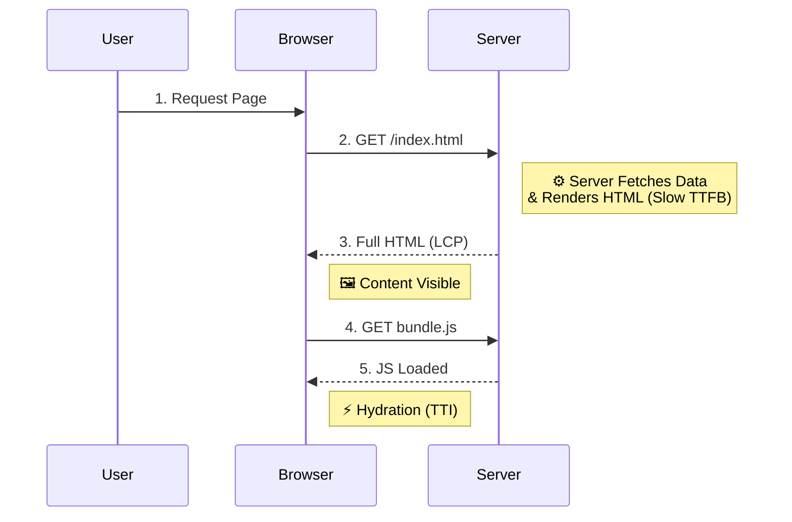
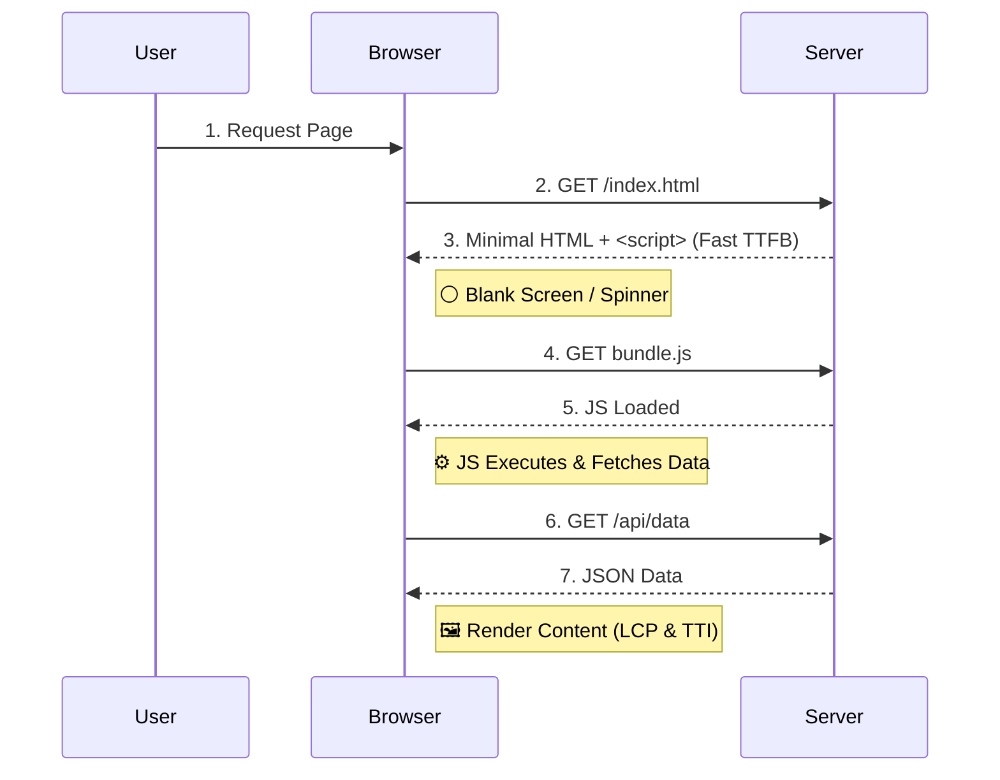
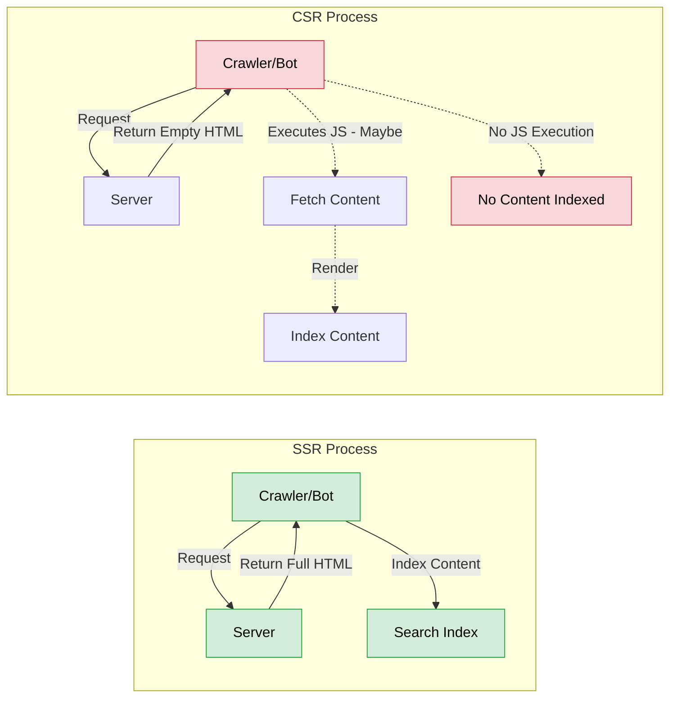
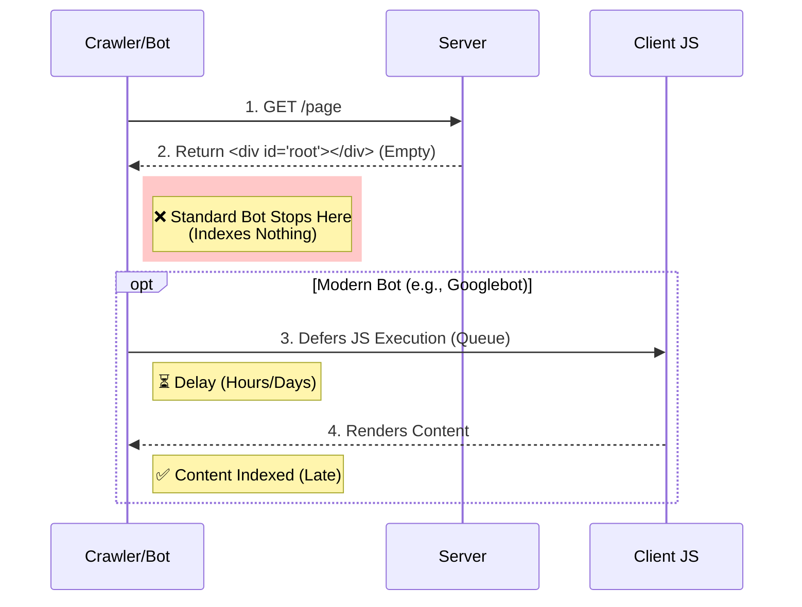
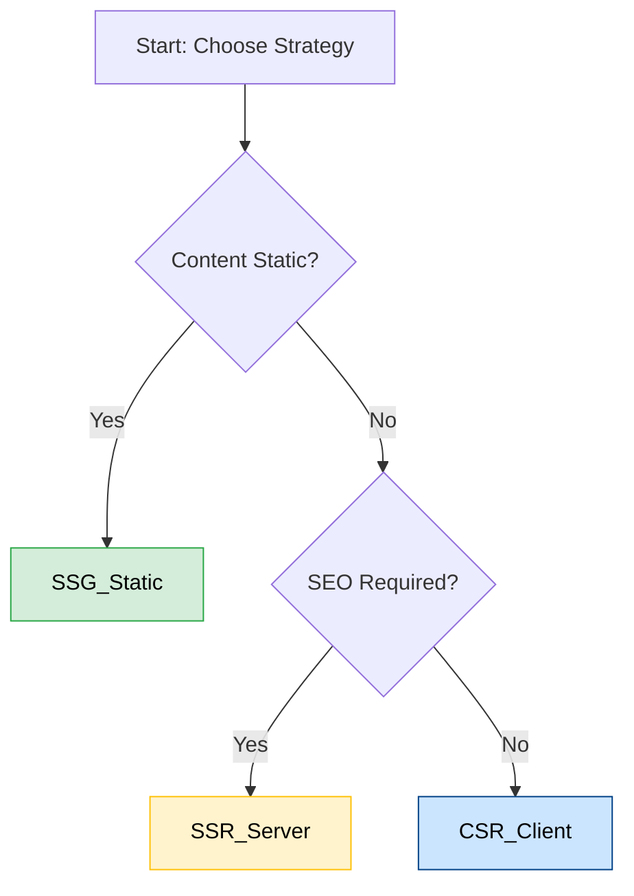

# Web Performance Foundation Q&A

## Q1: What is LCP (Largest Contentful Paint)?
en: LCP measures the loading performance of a web page. It marks the point in the page load timeline when the page's main content has likely loaded. A good LCP score is 2.5 seconds or less.
vi: LCP (Nội dung hiển thị lớn nhất) đo lường hiệu suất tải của một trang web. Nó đánh dấu thời điểm trong dòng thời gian tải trang khi nội dung chính của trang có khả năng đã được tải xong. Điểm LCP tốt là 2.5 giây trở xuống.

---

## Q2: What is TTI (Time to Interactive)?
en: TTI measures how long it takes for a page to become fully interactive. A page is considered fully interactive when it displays useful content (First Contentful Paint - FCP), event handlers are registered for most visible page elements, and the page responds to user interactions within 50 milliseconds.
vi: TTI (Thời gian tương tác) đo thời gian cần thiết để một trang trở nên hoàn toàn tương tác. Một trang được coi là hoàn toàn tương tác khi nó hiển thị nội dung hữu ích (First Contentful Paint - FCP), các trình xử lý sự kiện đã được đăng ký cho hầu hết các phần tử trang hiển thị và trang phản hồi lại các tương tác của người dùng trong vòng 50 mili giây.

---

## Q3: What is CLS (Cumulative Layout Shift) and why does it matter?
en: CLS measures visual stability. It quantifies how much visible content shifts unexpectedly during the page's lifespan. A low CLS score (0.1 or less) ensures a good user experience by preventing accidental clicks and jarring visual changes.
vi: CLS (Điểm thay đổi bố cục tích lũy) đo lường độ ổn định hình ảnh. Nó định lượng mức độ dịch chuyển bất ngờ của nội dung hiển thị trong suốt vòng đời của trang. Điểm CLS thấp (0.1 trở xuống) đảm bảo trải nghiệm người dùng tốt bằng cách ngăn chặn các lần nhấp tình cờ và những thay đổi hình ảnh gây khó chịu.

---

## Q4: What are Core Web Vitals?
en: Core Web Vitals are a set of specific factors that Google considers important in a webpage's overall user experience. They currently consist of three metrics: LCP (loading), FID/INP (interactivity), and CLS (visual stability).
vi: Core Web Vitals (Các chỉ số thiết yếu về trang web) là tập hợp các yếu tố cụ thể mà Google coi là quan trọng trong trải nghiệm người dùng tổng thể của một trang web. Hiện tại chúng bao gồm ba chỉ số: LCP (tải trang), FID/INP (tương tác) và CLS (ổn định hình ảnh).

---

## Q5: What is FCP (First Contentful Paint)?
en: FCP measures the time from when the page starts loading to when any part of the page's content is rendered on the screen. "Content" refers to text, images (including background images), `<svg>` elements, or non-white `<canvas>` elements.
vi: FCP (Lần hiển thị nội dung đầu tiên) đo thời gian từ khi trang bắt đầu tải đến khi bất kỳ phần nào của nội dung trang được render trên màn hình. "Nội dung" ở đây đề cập đến văn bản, hình ảnh (bao gồm cả hình nền), các phần tử `<svg>` hoặc các phần tử `<canvas>` không phải màu trắng.

---

## Q6: What is TTFB (Time to First Byte)?
en: TTFB measures the time between the browser requesting a page and when it receives the first byte of information from the server. It is a foundational metric for measuring connection setup time and web server responsiveness.
vi: TTFB (Thời gian đến byte đầu tiên) đo thời gian giữa lúc trình duyệt yêu cầu một trang và khi nó nhận được byte thông tin đầu tiên từ máy chủ. Đây là một chỉ số nền tảng để đo thời gian thiết lập kết nối và khả năng phản hồi của máy chủ web.

---

## Q7: What is the Critical Rendering Path (CRP)?
en: The Critical Rendering Path is the sequence of steps the browser goes through to convert HTML, CSS, and JavaScript into pixels on the screen. Optimizing CRP improves render performance.
vi: Đường dẫn render quan trọng (Critical Rendering Path - CRP) là chuỗi các bước mà trình duyệt trải qua để chuyển đổi HTML, CSS và JavaScript thành các pixel trên màn hình. Việc tối ưu hóa CRP giúp cải thiện hiệu suất render.

---

## Q8: Explain the difference between DOMContentLoaded and the load event.
en: The `DOMContentLoaded` event fires when the initial HTML document has been completely loaded and parsed, without waiting for stylesheets, images, and subframes to finish loading. The `load` event fires when the whole page has loaded, including all dependent resources such as stylesheets and images.
vi: Sự kiện `DOMContentLoaded` kích hoạt khi tài liệu HTML ban đầu đã được tải và phân tích cú pháp hoàn toàn mà không cần chờ các stylesheet, hình ảnh và khung con (subframes) tải xong. Sự kiện `load` kích hoạt khi toàn bộ trang đã tải xong, bao gồm tất cả các tài nguyên phụ thuộc như stylesheet và hình ảnh.

---

## Q9: What is Lighthouse?
en: Lighthouse is an open-source, automated tool for improving the quality of web pages. It has audits for performance, accessibility, progressive web apps, SEO, and more. It runs in Chrome DevTools, from the command line, or as a Node module.
vi: Lighthouse là một công cụ mã nguồn mở, tự động để cải thiện chất lượng của các trang web. Nó có các bài kiểm tra audit cho hiệu suất, khả năng truy cập, ứng dụng web lũy tiến (PWA), SEO và nhiều thứ khác. Nó chạy trong Chrome DevTools, từ dòng lệnh hoặc dưới dạng module Node.

---

## Q10: What is the difference between Lab Data and Field Data (RUM)?

en: Lab Data is performance data collected in a controlled environment with predefined device and network settings (e.g., Lighthouse). Field Data (Real User Monitoring or RUM) is performance data collected from real users visiting your site on their actual devices and network conditions (e.g., Chrome User Experience Report).
vi: Dữ liệu phòng thí nghiệm (Lab Data) là dữ liệu hiệu suất được thu thập trong môi trường được kiểm soát với các cài đặt thiết bị và mạng được xác định trước (ví dụ: Lighthouse). Dữ liệu thực tế (Field Data hoặc RUM) là dữ liệu hiệu suất được thu thập từ người dùng thực truy cập trang web của bạn trên các thiết bị và điều kiện mạng thực tế của họ (ví dụ: Báo cáo trải nghiệm người dùng Chrome).

---

## Q11: What is Server-Side Rendering (SSR) and how does it impact performance? - **HIGHT**
en: SSR is the process of rendering web pages on the server and sending the fully rendered HTML to the client. This improves First Contentful Paint (FCP) and LCP, making the content visible sooner, but can increase Time to First Byte (TTFB) due to server processing time.
vi: SSR (Render phía máy chủ) là quá trình render các trang web trên máy chủ và gửi HTML đã được render đầy đủ đến máy khách. Điều này cải thiện thời gian hiển thị nội dung đầu tiên (FCP) và LCP, làm cho nội dung hiển thị sớm hơn, nhưng có thể làm tăng thời gian đến byte đầu tiên (TTFB) do thời gian xử lý của máy chủ.

### Visualization (Minh họa)

---

## Q12: What is Client-Side Rendering (CSR) and what are its trade-offs? - **HIGHT**
en: CSR is where the browser downloads a minimal HTML page and uses JavaScript to render the content. It often provides a faster Time to Interactive (TTI) after the initial load and smoother transitions, but suffers from slower initial load times (poor LCP) and potential SEO challenges compared to SSR.
vi: CSR (Render phía máy khách) là nơi trình duyệt tải xuống một trang HTML tối thiểu và sử dụng JavaScript để render nội dung. Nó thường cung cấp thời gian tương tác (TTI) nhanh hơn sau lần tải đầu tiên và chuyển trang mượt mà hơn, nhưng chịu thời gian tải ban đầu chậm hơn (LCP kém) và các thách thức SEO tiềm ẩn so với SSR.

### Visualization (Minh họa)

---

## Q13: Why is Server-Side Rendering (SSR) good for SEO?
en: SSR improves SEO because it serves a fully rendered HTML page to the client. This allows search engine crawlers (bots) to easily parse and index the content immediately without needing to execute JavaScript. While modern crawlers like Googlebot can render JavaScript, SSR guarantees indexability and is faster for crawlers to process.
vi: SSR tốt cho SEO vì nó phục vụ một trang HTML đã được render đầy đủ cho máy khách. Điều này cho phép các trình thu thập thông tin của công cụ tìm kiếm (bots) dễ dàng phân tích và lập chỉ mục nội dung ngay lập tức mà không cần thực thi JavaScript. Mặc dù các trình thu thập thông tin hiện đại như Googlebot có thể render JavaScript, SSR đảm bảo khả năng lập chỉ mục và xử lý nhanh hơn cho các trình thu thập thông tin.

### Visualization (Minh họa)

---

## Q14: Why is Client-Side Rendering (CSR) often problematic for SEO?
en: CSR requires the browser (or bot) to execute JavaScript to reveal the page content. Standard crawlers may see an empty page if they don't execute JS. Even capable bots (like Googlebot) render content in a second pass (queued), which delays indexing. Furthermore, if the JS bundle is large or fails to load, the content remains invisible to the search engine.
vi: CSR yêu cầu trình duyệt (hoặc bot) thực thi JavaScript để hiển thị nội dung trang. Các trình thu thập thông tin tiêu chuẩn có thể thấy một trang trống nếu chúng không thực thi JS. Ngay cả các bot có khả năng (như Googlebot) cũng render nội dung trong lượt thứ hai (được xếp hàng), làm chậm quá trình lập chỉ mục. Hơn nữa, nếu gói JS lớn hoặc không tải được, nội dung sẽ vẫn vô hình đối với công cụ tìm kiếm.

### Visualization (Minh họa)

---

## Q15: What are the best practices for choosing a rendering strategy (SSR vs. CSR vs. SSG)?
en: The best practice is to align the strategy with your content needs. Use **SSG** (Static Site Generation) for static content like blogs or marketing pages for maximum performance. Use **SSR** for dynamic, personalized content that requires SEO (e.g., e-commerce product pages). Use **CSR** for private, highly interactive dashboards where SEO is irrelevant. Next.js allows you to mix these strategies per page for an optimal hybrid approach.
vi: Thực tiễn tốt nhất là chọn chiến lược phù hợp với nhu cầu nội dung của bạn. Sử dụng **SSG** (Tạo trang tĩnh) cho nội dung tĩnh như blog hoặc trang tiếp thị để có hiệu suất tối đa. Sử dụng **SSR** cho nội dung động, cá nhân hóa cần SEO (ví dụ: trang sản phẩm thương mại điện tử). Sử dụng **CSR** cho các bảng điều khiển riêng tư, có tính tương tác cao nơi SEO không quan trọng. Next.js cho phép bạn kết hợp các chiến lược này trên từng trang để có giải pháp lai tối ưu.

### Visualization (Minh họa)

