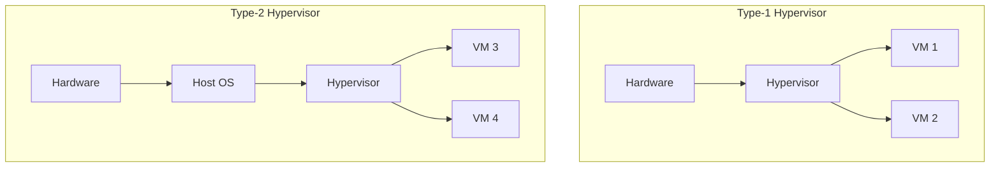

# Advanced Operating Systems Questions & Answers

## 1. Monolithic Kernel vs. Microkernel Architecture
**Answer**:
en: 
- **Monolithic Kernel**: All OS services (File system, VFS, device drivers, memory management) run in kernel space. High performance but fragile (one bug can crash the whole system). Examples: Linux, Windows (hybrid).
- **Microkernel**: Only essential services (IPC, basic scheduling, basic memory management) run in kernel space. Others run in user space. High modularity and stability but lower performance due to context switching overhead. Examples: QNX, L4.
vi:
- **Nhân nguyên khối (Monolithic Kernel)**: Tất cả các dịch vụ hệ điều hành (Hệ thống tệp, VFS, trình điều khiển thiết bị, quản lý bộ nhớ) chạy trong không gian nhân. Hiệu suất cao nhưng dễ hỏng (một lỗi có thể làm sập toàn bộ hệ thống). Ví dụ: Linux, Windows (lai).
- **Vi nhân (Microkernel)**: Chỉ các dịch vụ thiết yếu (IPC, lập lịch cơ bản, quản lý bộ nhớ cơ bản) chạy trong không gian nhân. Các dịch vụ khác chạy trong không gian người dùng. Tính mô-đun và độ ổn định cao nhưng hiệu suất thấp hơn do chi phí chuyển đổi ngữ cảnh. Ví dụ: QNX, L4.

## 2. Explain the Translation Lookaside Buffer (TLB).
**Answer**:
en: The TLB is a high-speed cache used by the Memory Management Unit (MMU) to speed up virtual-to-physical address translation. It stores recently used mapping entries. If a translation is in the TLB (TLB hit), the address is obtained quickly; otherwise (TLB miss), a page table walk is required.
vi: TLB là một bộ nhớ đệm tốc độ cao được sử dụng bởi Đơn vị quản lý bộ nhớ (MMU) để tăng tốc độ dịch địa chỉ ảo sang địa chỉ vật lý. Nó lưu trữ các mục ánh xạ được sử dụng gần đây. Nếu phép dịch có trong TLB (TLB hit), địa chỉ sẽ được lấy nhanh chóng; nếu không (TLB miss), cần phải duyệt bảng trang (page table walk).

## 3. What is Thrashing and how can it be prevented?
**Answer**:
en: Thrashing occurs when a system spends more time swapping pages in and out of memory than executing actual instructions. This happens when the total working set of all processes exceeds the available physical memory. 
- **Prevention**: Use a working set model to ensure each process had enough frames, reduce the level of multiprogramming, or increase RAM.
vi: Thrashing (Trì trệ do tráo đổi) xảy ra khi hệ thống dành nhiều thời gian hơn để tráo đổi các trang vào và ra khỏi bộ nhớ thay vì thực thi các lệnh thực tế. Điều này xảy ra khi tổng tập hợp làm việc (working set) của tất cả các tiến trình vượt quá dung lượng bộ nhớ vật lý khả dụng.
- **Phòng ngừa**: Sử dụng mô hình tập hợp làm việc để đảm bảo mỗi tiến trình có đủ khung (frames), giảm mức độ đa chương trình, hoặc tăng dung lượng RAM.

## 4. Compare Type-1 and Type-2 Hypervisors.
**Answer**:
en:
- **Type-1 (Bare-metal)**: Runs directly on the hardware (e.g., Xen, VMware ESXi). It has better performance and security.
- **Type-2 (Hosted)**: Runs on top of a host OS (e.g., VirtualBox, VMware Workstation). It is easier to set up but has more overhead.

vi:
- **Type-1 (Bare-metal)**: Chạy trực tiếp trên phần cứng (v dụ: Xen, VMware ESXi). Nó có hiệu suất và tính bảo mật tốt hơn.
- **Type-2 (Hosted)**: Chạy trên nền của một hệ điều hành máy chủ (ví dụ: VirtualBox, VMware Workstation). Nó dễ cài đặt hơn nhưng có nhiều chi phí tốn kém hơn.

## 5. What are Spinlocks and when should they be used?
**Answer**:
en: A Spinlock is a lock where a thread "spins" (waits in a loop) until the lock becomes available. Spinlocks are efficient for very short-duration locks because they avoid the overhead of context switching. However, they waste CPU cycles if held for too long.
vi: Spinlock là một loại khóa mà một luồng "xoay" (đợi trong một vòng lặp) cho đến khi khóa khả dụng. Spinlock hiệu quả cho các khóa có thời gian rất ngắn vì chúng tránh được chi phí chuyển đổi ngữ cảnh. Tuy nhiên, chúng gây lãng phí chu kỳ CPU nếu bị giữ quá lâu.

## 6. Explain the Banker's Algorithm.
**Answer**:
en: The Banker's Algorithm is a resource allocation and deadlock avoidance algorithm. It tests for safety by simulating the allocation of predetermined maximum possible amounts of all resources, then makes an "s-state" check to test for possible activities, before deciding whether allocation should be allowed.
vi: Thuật toán Banker là một thuật toán cấp phát tài nguyên và tránh tắc nghẽn (deadlock). Nó kiểm tra tính an toàn bằng cách mô phỏng việc cấp phát số lượng tối đa định trước của tất cả các tài nguyên, sau đó thực hiện kiểm tra "trạng thái an toàn" để thử các hoạt động có thể có, trước khi quyết định xem việc cấp phát có nên được cho phép hay không.

## 7. What is Direct Memory Access (DMA)?
**Answer**:
en: DMA allows certain hardware subsystems (like disk controllers or network cards) to access main system memory independently of the CPU. This reduces CPU overhead because the CPU only needs to initiate the transfer and is notified via an interrupt when it's done.
vi: Truy cập bộ nhớ trực tiếp (DMA) cho phép một số hệ thống con phần cứng (như bộ điều khiển đĩa hoặc card mạng) truy cập bộ nhớ hệ thống chính một cách độc lập với CPU. Điều này giúp giảm tải cho CPU vì CPU chỉ cần bắt đầu quá trình truyền và được thông báo qua một ngắt khi quá trình hoàn tất.

## 8. What is a Futex (Fast Userspace Mutex)?
**Answer**:
en: A futex is a Linux kernel primitive used to implement locking mechanisms efficiently. It performs the "fast path" (lock acquisition when there is no contention) entirely in user space without a system call. It only enters the kernel (slow path) when there is contention or a need to wait.
vi: Futex là một nguyên ngữ của nhân Linux được sử dụng để triển khai các cơ chế khóa một cách hiệu quả. Nó thực hiện "đường dẫn nhanh" (lấy khóa khi không có tranh chấp) hoàn toàn trong không gian người dùng mà không cần lời gọi hệ thống. Nó chỉ vào nhân (đường dẫn chậm) khi có tranh chấp hoặc cần phải đợi.

## 9. Explain Journaling in File Systems.
**Answer**:
en: Journaling is a technique where the file system keeps a log (journal) of changes that will be made before actually committing them to the main file system. In case of a system crash, the journal can be used to restore the file system to a consistent state quickly.
vi: Journaling (Ghi nhật ký) là một kỹ thuật trong đó hệ thống tệp lưu giữ một nhật ký về các thay đổi sẽ được thực hiện trước khi thực sự cam kết chúng vào hệ thống tệp chính. Trong trường hợp hệ thống bị sập, nhật ký có thể được sử dụng để khôi phục hệ thống tệp về trạng thái nhất quán một cách nhanh chóng.

## 10. What is the difference between Preemptive and Non-Preemptive Scheduling?
**Answer**:
en:
- **Preemptive**: The OS can interrupt a running process and give the CPU to another process (e.g., Round Robin, SRTF).
- **Non-Preemptive**: A process keeps the CPU until it terminates or switches to a waiting state (e.g., FCFS, SJF).
vi:
- **Ưu tiên (Preemptive)**: Hệ điều hành có thể ngắt một tiến trình đang chạy và cấp CPU cho một tiến trình khác (ví dụ: Round Robin, SRTF).
- **Không ưu tiên (Non-Preemptive)**: Một tiến trình giữ CPU cho đến khi nó kết thúc hoặc chuyển sang trạng thái chờ (ví dụ: FCFS, SJF).
