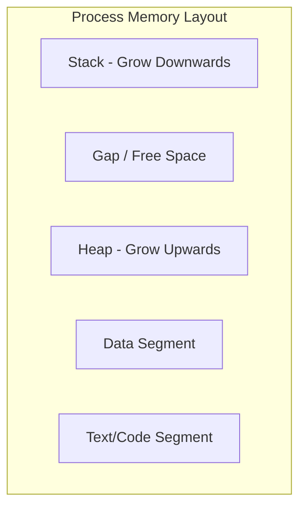

# Foundational Operating Systems Questions & Answers

## 1. What is an Operating System (OS)?
**Answer**:
en: An Operating System is software that acts as an interface between computer hardware and the user. It manages hardware resources (CPU, memory, storage) and provides common services for computer programs.
vi: Hệ điều hành (OS) là phần mềm đóng vai trò là giao diện giữa phần cứng máy tính và người dùng. Nó quản lý các tài nguyên phần cứng (CPU, bộ nhớ, lưu trữ) và cung cấp các dịch vụ chung cho các chương trình máy tính.

## 2. What is the Kernel?
**Answer**:
en: The Kernel is the core part of an operating system that manages system resources and the communication between hardware and software components. It handles memory management, process management, and disk management.
vi: Kernel (Nhân) là phần cốt lõi của hệ điều hành, quản lý tài nguyên hệ thống và sự giao tiếp giữa các thành phần phần cứng và phần mềm. Nó xử lý quản lý bộ nhớ, quản lý tiến trình và quản lý đĩa.

## 3. What is the difference between a Process and a Thread?
**Answer**:
en: 
- **Process**: An executing program with its own memory space (stack, heap, code). Processes are independent.
- **Thread**: A basic unit of CPU utilization within a process. Threads of the same process share the same memory space but have their own registers and stack.
vi: 
- **Tiến trình (Process)**: Một chương trình đang thực thi với không gian bộ nhớ riêng (stack, heap, code). Các tiến trình hoạt động độc lập.
- **Luồng (Thread)**: Một đơn vị cơ bản của việc sử dụng CPU trong một tiến trình. Các luồng trong cùng một tiến trình chia sẻ cùng một không gian bộ nhớ nhưng có thanh ghi và stack riêng.

## 4. Name the different states of a Process.
**Answer**:
en: The common states are:
- **New**: The process is being created.
- **Ready**: The process is waiting to be assigned to a processor.
- **Running**: Instructions are being executed.
- **Waiting/Blocked**: The process is waiting for some event (like I/O completion).
- **Terminated**: The process has finished execution.
vi: Các trạng thái phổ biến là:
- **Mới (New)**: Tiến trình đang được tạo.
- **Sẵn sàng (Ready)**: Tiến trình đang đợi được cấp phát bộ xử lý.
- **Đang chạy (Running)**: Các lệnh đang được thực thi.
- **Chờ/Bị chặn (Waiting/Blocked)**: Tiến trình đang đợi một sự kiện nào đó (như hoàn thành I/O).
- **Kết thúc (Terminated)**: Tiến trình đã hoàn thành việc thực thi.

## 5. What is Context Switching?
**Answer**:
en: Context Switching is the process of storing the state of a process or thread so that it can be restored and resume execution at a later point. This allows multiple processes to share a single CPU.
vi: Chuyển đổi ngữ cảnh (Context Switching) là quá trình lưu trữ trạng thái của một tiến trình hoặc luồng để nó có thể được khôi phục và tiếp tục thực thi sau đó. Điều này cho phép nhiều tiến trình chia sẻ một CPU duy nhất.

## 6. What is virtual memory?
**Answer**:
en: Virtual memory is a memory management technique that provides an "idealized abstraction" of the storage resources that are actually available on a given machine, allowing the computer to use hardware more efficiently by using disk space as an extension of RAM.
vi: Bộ nhớ ảo (Virtual memory) là một kỹ thuật quản lý bộ nhớ cung cấp một "sự trừu tượng hóa lý tưởng" của tài nguyên lưu trữ thực sự có sẵn trên một máy nhất định, cho phép máy tính sử dụng phần cứng hiệu quả hơn bằng cách dùng không gian đĩa như một phần mở rộng của RAM.

## 7. What are the four necessary conditions for a Deadlock?
**Answer**:
en:
1. **Mutual Exclusion**: At least one resource must be held in a non-sharable mode.
2. **Hold and Wait**: A process must be holding at least one resource and waiting to acquire additional resources.
3. **No Preemption**: Resources cannot be taken away from a process.
4. **Circular Wait**: A set of processes exists such that each process is waiting for a resource held by the next process in the set.
vi:
1. **Loại trừ lẫn nhau (Mutual Exclusion)**: Ít nhất một tài nguyên phải được giữ ở chế độ không thể chia sẻ.
2. **Giữ và đợi (Hold and Wait)**: Một tiến trình phải đang giữ ít nhất một tài nguyên và đang đợi để lấy thêm các tài nguyên khác.
3. **Không cưỡng chế (No Preemption)**: Tài nguyên không thể bị thu hồi từ một tiến trình.
4. **Chờ đợi vòng tròn (Circular Wait)**: Tồn tại một tập hợp các tiến trình sao cho mỗi tiến trình đang đợi một tài nguyên được giữ bởi tiến trình tiếp theo trong tập hợp.

## 8. What is the difference between Paging and Segmentation?
**Answer**:
en:
- **Paging**: Divides memory into fixed-size blocks (pages). It eliminates external fragmentation.
- **Segmentation**: Divides memory into logical units (segments) like functions, objects, or arrays. It leads to external fragmentation.
vi:
- **Phân trang (Paging)**: Chia bộ nhớ thành các khối có kích thước cố định (trang). Nó loại bỏ phân mảnh ngoại vi.
- **Phân đoạn (Segmentation)**: Chia bộ nhớ thành các đơn vị logic (đoạn) như hàm, đối tượng hoặc mảng. Nó dẫn đến phân mảnh ngoại vi.

## 9. What is an Interrupt?
**Answer**:
en: An interrupt is a signal to the processor emitted by hardware or software indicating an event that needs immediate attention. The processor suspends its current activities and executes an interrupt service routine (ISR).
vi: Ngắt (Interrupt) là một tín hiệu gửi đến bộ xử lý do phần cứng hoặc phần mềm phát ra, cho thấy một sự kiện cần được chú ý ngay lập tức. Bộ xử lý tạm dừng các hoạt động hiện tại và thực thi một chương trình phục vụ ngắt (ISR).

## 10. What is a System Call?
**Answer**:
en: A System Call is the programmatic way in which a computer program requests a service from the kernel of the operating system it is executed on. Examples include `open()`, `read()`, `write()`, and `fork()`.
vi: Lời gọi hệ thống (System Call) là cách thức lập trình mà một chương trình máy tính yêu cầu một dịch vụ từ nhân của hệ điều hành mà nó đang thực thi trên đó. Ví dụ bao gồm `open()`, `read()`, `write()`, và `fork()`.

## 11. What is the difference between Stack and Heap memory?
**Answer**:
en: 
- **Stack**: Used for static memory allocation and active function calls. It follows LIFO (Last-In-First-Out). Access is fast, but size is limited and managed automatically by the CPU.
- **Heap**: Used for dynamic memory allocation. Memory is allocated and deallocated explicitly by the programmer (or garbage collector). It is larger and more flexible but slower to access and requires manual management to avoid memory leaks.

vi:
- **Stack (Ngăn xếp)**: Được sử dụng để cấp phát bộ nhớ tĩnh và các lời gọi hàm đang hoạt động. Nó tuân theo cơ chế LIFO (Vào sau ra trước). Truy cập nhanh, nhưng kích thước có hạn và được CPU quản lý tự động.
- **Heap (Đống)**: Được sử dụng để cấp phát bộ nhớ động. Bộ nhớ được cấp phát và giải phóng rõ ràng bởi lập trình viên (hoặc bộ thu gom rác). Nó lớn hơn và linh hoạt hơn nhưng truy cập chậm hơn và yêu cầu quản lý thủ công để tránh rò rỉ bộ nhớ.

**Note: Why is the Stack faster than the Heap?**
en:
1. **Allocation Speed**: Stack allocation only requires moving the Stack Pointer. Heap requires searching for free blocks using complex algorithms.
2. **Access Speed**: Stack has better **CPU Cache locality** because data is stored compactly. Heap access involves pointer dereferencing (extra clock cycles).
3. **Deallocation**: Stack memory is "reclaimed" instantly when a function returns. Heap requires manual deallocation or Garbage Collection overhead.

vi:
**Lưu ý: Tại sao Stack lại nhanh hơn Heap?**
1. **Tốc độ cấp phát**: Cấp phát trên Stack chỉ cần di chuyển Con trỏ Stack. Heap yêu cầu tìm kiếm các khối trống bằng các thuật toán phức tạp.
2. **Tốc độ truy cập**: Stack có **tính cục bộ của bộ nhớ đệm (Cache locality)** tốt hơn vì dữ liệu được lưu trữ tập trung. Truy cập Heap liên quan đến việc giải tham chiếu con trỏ (tốn thêm chu kỳ xung nhịp).
3. **Giải phóng bộ nhớ**: Bộ nhớ Stack được "thu hồi" tức thì khi hàm kết thúc. Heap yêu cầu giải phóng thủ công hoặc chi phí từ Bộ thu gom rác.
